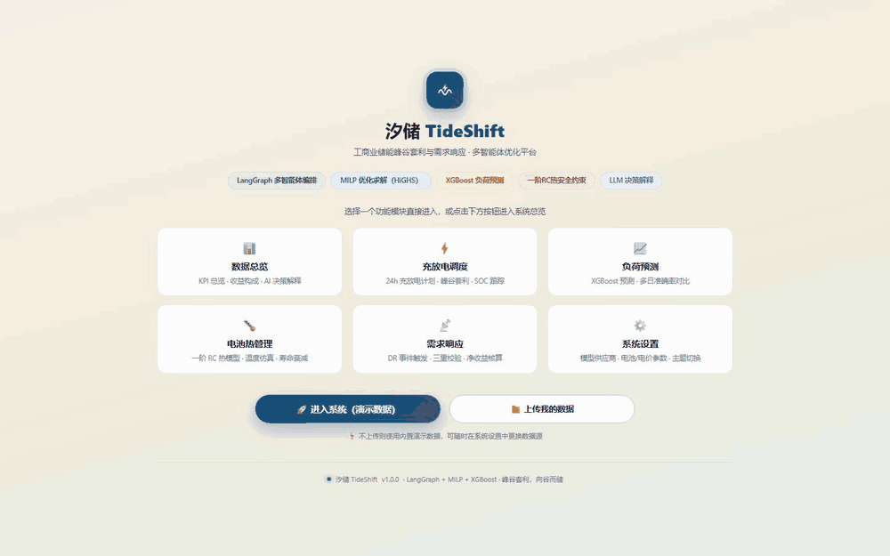
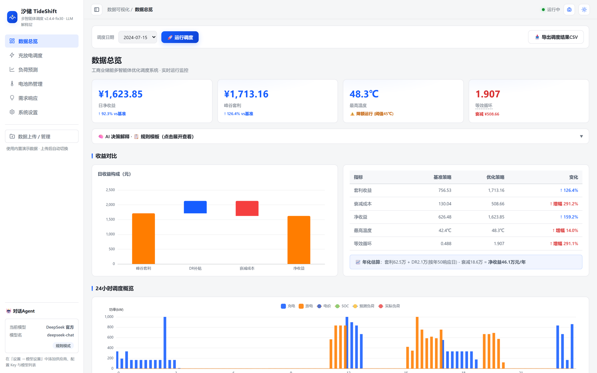
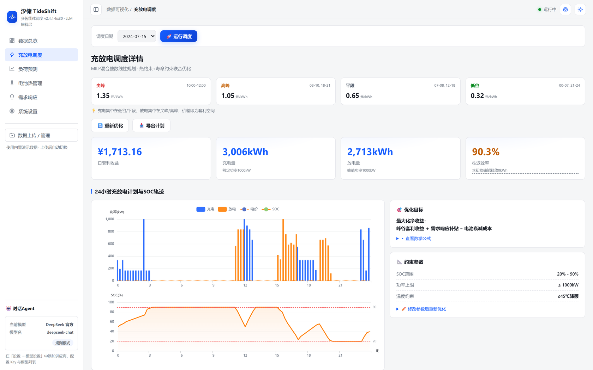
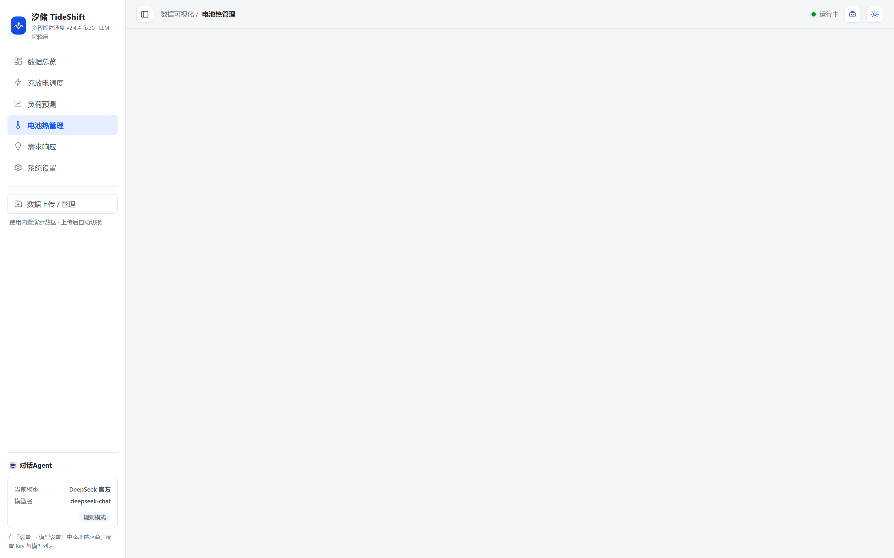
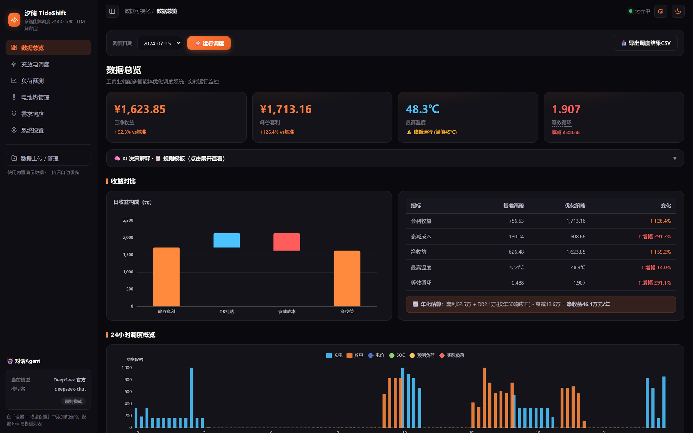
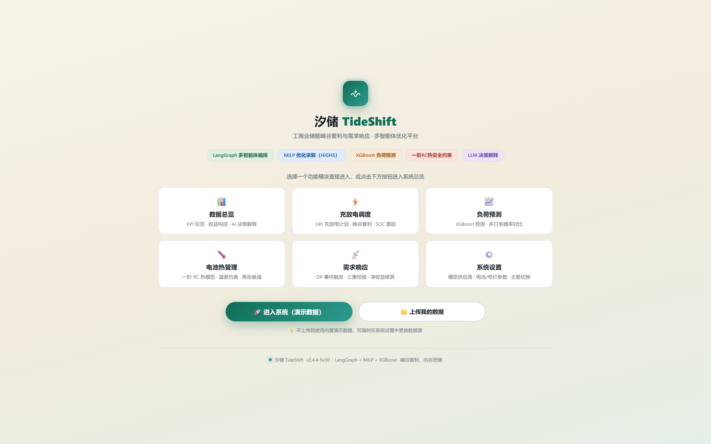
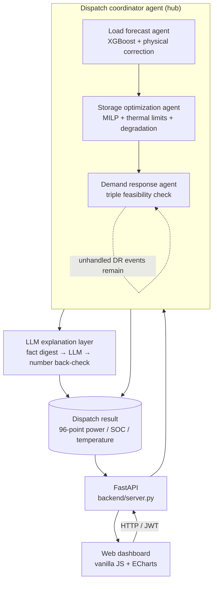

<div align="center">

# TideShift 汐储
**Multi-agent dispatch optimization for C&I battery storage: peak-valley arbitrage and demand response**

Battery heat generation, temperature-rise limits and cycle-life degradation are priced into the MILP objective. What comes out is not a pretty curve — it is a dispatch plan a real battery can survive.


</div>

> Language: [中文](README.md) | **English**

## In 30 seconds
**What it solves**: peak-charge / valley-discharge storage demos are everywhere, but the assumptions that make their revenue look good — whether the battery overheats, how much life it burns, whether any energy is left to sell tomorrow — usually never enter the model. This project writes all three **into the MILP's constraints and objective**, uses multi-agent + LLM to explain the result, and measures with an evaluation suite whether the numbers in that explanation were invented.
- **Optimization vs baseline**: daily net revenue 626.49 → **1198.12 CNY (+91.2%)**, annualized **437,000 CNY** (same caliber as the baseline, no DR subsidies);
- **The cost of constraints, shown**: the thermal constraints give up 8.5% of revenue and bring peak temperature 57.12 → **46.99 ℃** (back inside the derating band, 8 ℃ below the shutdown threshold);
- **Agent behaviour is measured**: offline rule mode, 32 cases → task success **0.969**, number fidelity **1.000**, fabricated-number catch rate **0.750**; with a real model (`deepseek-flash`) the same-denominator 32 cases drop to **0.938** — which two of the three losses are the grader's fault is written up in [`evals/`](evals/README.md);
- **Tunes its own constraints and admits defeat honestly**: propose → evaluate on real MILP → re-verify at equal resolution; on this dataset it **did not beat the default constraints**, and the [report](docs/parameter-search-sample.md) says exactly that;
- **Reproducible**: **247 tests** (215 fast + 32 slow), `requirements.lock` pinning every dependency, frontend assets vendored locally — **the whole flow runs with the network unplugged**.
> Three things it does not dodge: the bundled `data/` is **synthetic demo data**; the load-forecast XGBoost sits at **3.12% MAPE, slightly behind the naive baseline's 3.01%**; DR settles on "discharged energy × subsidy" with **no CBL baseline modelled**. All of it is listed in [Known limitations and roadmap](#known-limitations-and-roadmap).



> The clip above is a **real recording**, not a mockup: headless Chromium drives the local service through the whole chain on the bundled demo data, dispatch day 2024-07-15. **No LLM key is configured**, so the answer on the right comes from the rule template — and it labels its own source. 19.8 s / 0.43 MB / loops forever. Static shots: [Screenshots](#screenshots).

> **Project positioning**: a **reference implementation / demo system** for discussion and teaching, not a dispatch product you can deploy. The revenue figures rest on simplifying assumptions (see [Known limitations and roadmap](#known-limitations-and-roadmap)) and are **not** a basis for dispatch decisions, financial settlement, or capacity planning.

> ### ⚠️ Read this before exposing it to the public internet
> TideShift targets **single-machine / intranet** use and binds to `127.0.0.1:8800` by default. Public exposure requires all three of the following first: **①** change the admin password (set `ADMIN_INITIAL_PASSWORD`, or change it immediately at first login); **②** place it behind an HTTPS reverse proxy; **③** restrict access to `config/` and `.solve_cache/`. Details in [Configuration](#configuration).

> ### 📊 Data provenance
> Everything under `data/` is **synthetic demo data**, generated by `src/data/data_generator.py` from a deterministic daily profile plus 3% noise. It **does not represent any real enterprise load** and must not be used for production settlement or capacity planning. Upload your own data and the system switches over automatically — [Usage](#usage) → Data upload. Every quantitative claim here is tagged with the environment and accounting caliber it was measured under — [Measured results](#measured-results).

---

## Contents
[In 30 seconds](#in-30-seconds) · [Overview](#overview) · [Screenshots](#screenshots) · [Core features](#core-features) · [Architecture](#architecture) · [Requirements](#requirements) · [Installation](#installation) · [Quick start](#quick-start) · [Usage](#usage) · [Configuration](#configuration) · [Project layout](#project-layout) · [Technical details](#technical-details) · [Measured results](#measured-results) · [Testing](#testing) · [FAQ](#faq) · [Contributing](#contributing) · [Known limitations and roadmap](#known-limitations-and-roadmap) · [License](#license)

## Overview
**TideShift 汐储** is a dispatch optimizer for a 1MW/2MWh commercial-and-industrial LFP battery running on Guangdong's peak-valley industrial/commercial tariff. Decisions are made on a 96-point (15-minute) grid, and one run does three things: **forecast next-day load → solve the optimal charge/discharge plan → evaluate and respond to grid demand-response (DR) invitations**, finishing with an explainable account of why.

Unlike most storage-dispatch demos, the difference here is whether **engineering constraints actually reached the optimization model**:
- Joule heating `I²R(1+k)` is **quadratic** in power. Many projects linearize it away or drop it. Here it enters the MILP through an SOS2 piecewise **chord upper approximation**, and the approximation direction is chosen so it stays conservative.
- Degradation is not a constant. **Deep cycling (low/high SOC bands) degrades 2~3× faster than shallow cycling.** Each interval's throughput is split across 4 SOC bands and billed at the band coefficient via big-M plus binaries, so the optimizer "sees" the real cost structure.
- A **steady-state daily-cycle constraint** (`SOC[96] == SOC[0]`) rules out the unsustainable "paper optimum" that drains the starting SOC for one profitable day and leaves nothing to sell the next.

Delivery is a web dashboard (FastAPI + vanilla JS + ECharts, all frontend assets vendored, fully offline): open a browser and the whole pipeline runs.
> **Tech keywords**: PuLP / HiGHS, MILP + SOS2 piecewise linearization, XGBoost, LangGraph, LLM decision-explanation layer with hallucination back-check, FastAPI.

## Screenshots
Clicking "开始求解" ("Start solving") runs the full chain — load forecast → MILP dispatch → demand response. Measured end to end on the development machine: **26 ~ 51 seconds**, MILP solve included.


<details>
<summary>Show the remaining screens (scheduling / thermal management / dark theme / welcome)</summary>

**Charge/discharge scheduling** — 24h plan, peak-valley arbitrage, SOC tracking:


**Battery thermal management** — first-order RC temperature simulation, derating bands, life degradation:


**Dashboard in dark theme**:


**Welcome page** — two entry points: enter with demo data, or upload your own:


</details>
> Screenshots are of the real UI (Playwright drives an actual login and an actual solve), not design mockups.

## Core features

| Feature | Notes |
|------|------|
| 🌡️ **First-order RC thermal model + quadratic heating** | Lumped-parameter heat transfer models battery temperature rise; the quadratic heating term uses an SOS2 chord upper approximation, so the temperature-ceiling constraint stays conservative |
| 🔋 **SOC-band weighted degradation** | Deep cycling costs 2~3× shallow cycling, written **into the objective** as big-M piecewise terms rather than a constant approximation |
| 🤖 **Three agents + two orchestration engines** | Load-forecast / storage-optimization / demand-response agents, orchestrated by either a LangGraph directed graph or plain Python; both produce identical output |
| 📈 **Physics-corrected load forecast** | XGBoost plus a heat-transfer temperature correction, with a **naive baseline always computed alongside** (cases where the baseline wins are reported as wins for the baseline) |
| 📡 **Triple DR validation** | Thermal safety + energy-usage floor + revenue check; DR is accepted only when net revenue is positive |
| 🧠 **LLM decision-explanation layer** | Dispatch results are compressed into a fact digest before the LLM phrases them; output numbers are back-checked and invented ones flagged; missing key / offline / errors all degrade to rule templates automatically |
| 🧪 **Constraint-parameter search agent** | Propose → evaluate on real MILP → re-verify → propose again. Solutions past the temperature limit cannot be selected, coarse-resolution numbers never reach the conclusion, and "did not beat the default" is written as "did not beat the default" |
| 💬 **Chat agent** | Rule mode + LLM mode, 8 tool functions (including whole-day explanation and Q&A over the digest), SSE streaming supported |
| 📊 **Web dashboard** | 7 pages (overview / scheduling / load forecast / thermal / demand response / run tracing / settings) plus light and dark themes |
| 📁 **Your own data** | NREL ComStock, Chinese industrial load, and standard-format files are detected automatically; the dispatch cache is keyed to a data fingerprint and invalidated on upload |

## Architecture


### Multi-agent orchestration (two engines)
**1. LangGraph orchestration (recommended)** — `src/agents/langgraph_coordinator.py`. A directed-graph state machine where DR event handling is a loop node and a conditional edge decides whether the next event still needs processing:
```
init → load_forecast → storage_optimization → dr_handler ⇄ finalize → explanation → END
```
**2. Plain-Python orchestration (lightweight)** — `src/agents/coordinator_agent.py`. A linear flow with a `for` loop over DR events and no LangGraph dependency.

Both engines produce **identical output**, asserted by `tests/test_langgraph.py`, so you pick by deployment environment without worrying about drift.

### Constraint-parameter search agent (the loop where the model drives control flow)
`src/agents/parameter_search_agent.py`. The main pipeline is a **fixed directed graph**: control flow is hard-coded in the orchestration and the LLM only writes prose at the end — that is a workflow, not an agent. This module adds a loop where the model genuinely decides:
```
propose constraints → evaluate on the real MILP → independently re-check feasibility
                              and safety → reflect → propose again
                              → (the model itself decides "enough", or the budget / time limit runs out)
```
Five guardrails, each with a test behind it:
1. **Safe beats optimal**: solutions past the 55 ℃ shutdown line **can be evaluated but cannot be selected** (`allow_unsafe_winner` defaults to False).
2. **Compare only at equal resolution**: the search runs at 24/48 points (0.4 ~ 2.5 seconds); the winner must return to 96 points and be re-verified head-to-head against default constraints. One configuration measured **1285.79 / 1279.09 / 1226.94 CNY** at 24 / 48 / 96 points (this triple is **not re-verified**, and its 24-point value disagrees with the 1260.58 CNY logged for the default constraints in the search sample - see [`docs/experiments.md` section 4](docs/experiments.md)), so comparing across resolutions is self-deception. The re-verification entry point raises immediately for anything other than 96 points.
3. **Safety policy is not searchable**: proposals touching `include_thermal` or `enable_dr` are rejected on arrival. Thermal constraints are a safety boundary, not a cost dial — and coarse resolution underestimates peak temperature by about 12 ℃ (35.4 ℃ measured at 24 points vs roughly 47 ℃ at 96 points), so the search phase **cannot see** the violation at all. A human may still change it explicitly in the UI; that is the human's decision.
4. **Solver noise is not a win**: with `mip_gap=1%`, re-solving the same configuration measured about 1% apart (three runs: 1244.24 / 1255.87 / 1260.58 CNY), so the bar for "beats default" is set at 2%.
5. **The agent is allowed to lose**: if re-verification does not beat the default configuration, the report says "did not beat the default" and default is used — the same caliber as "naive baseline first" in the forecast module.

Without an API key, a deterministic heuristic proposer (coordinate descent) runs the full loop. It doubles as the **non-intelligent baseline**: with nothing to compare against, "the agent works" has no content. One real run (bundled data, dispatch day 2024-07-30, 6 candidates, 1.8 seconds) is in [`docs/parameter-search-sample.md`](docs/parameter-search-sample.md); the conclusion is that **heuristic search did not beat the default constraints** — both lowering power and narrowing the SOC window reduced net revenue. That is an honest measurement, not a failed demo.
```bash
python -m src.agents.parameter_search_agent --date 2024-07-30 --search-steps 24 --max-steps 6
DEEPSEEK_API_KEY=sk-... python -m src.agents.parameter_search_agent --llm   # LLM proposes
```

## Requirements

| Item | Requirement |
|------|------|
| **OS** | Windows / Linux / macOS all fine (development and measurement environment was Windows 10) |
| **Python** | **3.13** — the only version fully verified here, see `.python-version`<br/>3.11 and below unverified; if you need them, get CI green first |
| **Solver** | HiGHS (via `highspy`, default) / CBC (bundled with PuLP, automatic fallback) |
| **Browser** | Any modern browser — Chrome / Edge / Firefox (ECharts is vendored in-repo, no network needed) |
| **Network** | Fully offline capable; only the LLM explanation layer and the chat agent's LLM mode need egress |

Python dependencies live in three files with non-overlapping jobs:

| File | Purpose | Install command |
|------|------|----------|
| `requirements.txt` | Direct runtime deps, written as `>=lower,<upper` ranges | `pip install -r requirements.txt` |
| `requirements.lock` | **Full lock**: all 76 packages (20 direct + 56 transitive) pinned to exact versions | `pip install -r requirements.lock` |
| `requirements-dev.txt` | Dev/test deps (`pytest`, `coverage`, `httpx`) | `pip install -r requirements-dev.txt` |

**How the two dependency files differ (important)**
- `requirements.txt` carries **range constraints**: the lower bound is a version measured to pass, the upper bound is the next version likely to break compatibility. What you install may end up one patch newer than what was measured (e.g. `langchain 1.3.14 → 1.3.15`), but it **will not jump a minor version**.
- `requirements.lock` is the **full lock**: **76 packages**, direct and transitive, each pinned, so the installed tree matches the measured environment **version for version**. **Use this one for CI and production.**
- The lock file carries **no hashes**: this project is cross-platform (Windows / Linux / macOS), while pip's hash checking requires per-platform hashes for every wheel, which would break that. If you need hash-level verification, generate it on the target platform with `pip-compile --generate-hashes` or `pip download` + `pip hash`.

**Version-pinning convention**: tightness follows risk — the AI orchestration stack (`langchain` / `langgraph`) is pinned to the minor version, `highspy` to the minor version (its version changes both solve time and numerics), and the scientific-computing / ML / web stacks to the major version.
> **Why not `~=`**: `langchain~=1.3` means `>=1.3,<2.0`, which still permits minor upgrades. A fresh install was observed resolving to `langchain 1.4.0`, `langchain-core 1.6.3`, `langchain-openai 1.6.2` and `uvicorn 0.53.0` — versions **never verified against this project** and on a different minor line than `requirements.lock` records. After tightening, direct dependencies no longer jump minor versions (mostly patch differences, e.g. `langchain 1.3.14 → 1.3.15`, `langchain-core 1.5.3 → 1.5.6`); the one exception is `uvicorn` (`0.52.1 → 0.53.0`, web stack pinned by major). For exact version-for-version equality, use `requirements.lock`.
> Maintenance rule: change a lower bound in `requirements.txt` and you must regenerate `requirements.lock` (the direct-dependency block has to match measured versions line by line) and re-run `pytest` (fast suite plus full suite).

## Installation
```bash
# 1. cd into the project root (after cloning or downloading)
cd TideShift

# 2. create a virtual environment (recommended; isolates deps)
python -m venv .venv

# Windows
.venv\Scripts\activate
# Linux / macOS
source .venv/bin/activate

# 3. install runtime dependencies (pick one of the two)
pip install -r requirements.txt     # normal: patch/minor upgrades allowed, still on the tested major-minor line
pip install -r requirements.lock    # strict: every version identical, transitive deps included; use for CI / production

# 4. optional: development and test dependencies (pytest / coverage / httpx)
pip install -r requirements-dev.txt

# 5. optional: verify the installation (needs step 4 first)
pytest -q
```
> **`pytest` is not a runtime dependency** — it belongs to `requirements-dev.txt`. If you only want the service running, finish step 3 and go straight to [Quick start](#quick-start); steps 4 and 5 are optional.

A demo dataset ships with the repo (four CSVs under `data/`), so **it launches as soon as installation ends, with no data preparation**. To regenerate the simulated data: `python -m src.data.data_generator`.

## Quick start
```bash
# start the web service (binds 127.0.0.1:8800 by default)
python backend/server.py
```
One-click scripts also exist (both open a browser, **prefer the project-local `.venv`**, fall back to `python` on `PATH`, and hard-code no machine-specific path):

| Platform | Command |
|------|------|
| Windows | Double-click `start_web.bat`; `restart_backend.bat` restarts the backend (frees port 8800 first, then starts and health-checks) |
| Linux / macOS | `./start_web.sh` |

### Login and the admin password
Every `/api/*` endpoint except login and version info is JWT-protected, so you log in first. The admin password has two management modes — **pick one that matches your deployment**:

| Mode | `ENERGY_AUTH_MODE` | Password source | Good for |
|------|----------------------|---------|---------|
| **persistent** (default) | leave empty | First start: `ADMIN_INITIAL_PASSWORD`, else a generated random password; from then on `config/auth.json` is authoritative | Long-lived local use, single-machine deploys |
| **env** | `env` | **Always** `ADMIN_INITIAL_PASSWORD`, never written to disk; **startup is refused if the variable is unset** (exit code 2) | Containers / CI / demos — changing the variable takes effect immediately and reinstalls need no file cleanup |

Startup prints one line that answers "where does my password come from" directly (verbatim console output, the UI is Chinese-only):
```
认证模式: persistent ｜ 口令来源: 口令文件 .../config/auth.json（环境变量只在首次创建且无此文件时生效；当前它**不会生效**）
认证模式: env ｜ 口令来源: ADMIN_INITIAL_PASSWORD（每次启动都生效，不落盘）
```
**Persistent mode (default)**: set `ADMIN_INITIAL_PASSWORD` before the first start and it initializes the password, so first login needs no change; leave it unset and the first start generates a strong random password, printed to the console **and** written to `config/INITIAL_PASSWORD.txt` (a one-time copy). First login then forces a password change; on success that file deletes itself, and if a crash leaves it behind, the next start cleans it up when it sees `must_change=false`. Under `ENERGY_AUTH_MODE=env` the password is owned by the environment, so `reset-password` refuses explicitly and tells you the actual way to change it (the in-app change returns 400 with the same reason) — no silent "changed it, but nothing took effect".

**Lost the password** (no manual file hunting):
```bash
python -m backend.manage show-state         # read-only: auth mode, password file location, state
python -m backend.manage reset-password     # reset to a fresh random strong password and print it
python -m backend.manage reset-password --password 'your-new-password'
```
**Security design**: passwords are stored as salted PBKDF2-HMAC-SHA256 hashes (200k iterations); JWT is HS256, expires after 12 hours by default, and is bound to a User-Agent fingerprint (**reusing a browser token from another browser or from curl gives a 401 with "登录环境已变化" ("the login environment has changed") — deliberate, not a bug**); login is rate limited per IP+account with exponential backoff on consecutive failures; unauthenticated access to protected endpoints returns 401.

**Credential file permissions** (all writes go through atomic write plus permission tightening):

| Platform | Mechanism | Does it form a permission boundary? |
|------|------|-----------------|
| POSIX | `chmod 0600` | ✅ Yes |
| Windows | `os.chmod` only toggles the read-only bit (measured: `stat` still reports `0o666` after writing `0o600`), so `icacls <file> /inheritance:r /grant:r "<current user>:F"` is called to tighten the ACL explicitly | ✅ Yes (measured ACL keeps only "current user / SYSTEM / Administrators"; the ordinary user group is removed). If `icacls` is unavailable a warning is logged and it falls back to relying on the parent directory's ACL |

> ⚠️ So **do not** describe `0600` as a cross-platform security boundary: on Windows the ACL above is what actually applies. Note too that with `ENERGY_AUTH_MODE=env` it is the **password** that stays off disk; the JWT signing key `config/.auth_secret` and the API-key encryption key `config/.api_secret` are still created — without them every restart would invalidate all tokens and make stored API keys undecryptable.

After login, click **"开始求解" ("Start solving")** to trigger the full dispatch flow (MILP solve included; **26 ~ 51 seconds** measured locally, varying with the day's size and machine performance). Results are cached on disk, so later visits are instant. Hitting the data endpoints before any solve returns `409 Conflict`, which is expected — solve once first.

## Usage
### Pages

| Page | Contents |
|------|------|
| 📊 **Dashboard** | Revenue KPIs, revenue composition, alert strip, AI decision explanation |
| ⚡ **Scheduling** | 24h charge/discharge plan, peak-valley arbitrage curves, SOC tracking, 96-point detail |
| 📈 **Load forecast** | Forecast vs actual, multi-day accuracy, naive-baseline comparison |
| 🌡️ **Battery thermal** | Temperature simulation curve, derating bands annotated, degradation cost |
| 📡 **Demand response** | DR events and outcomes, the three validation checks, net revenue accounting |
| 🔍 **Run tracing** | Event sequence per run: step durations, whether the LLM took the main path or degraded, slowest step |
| ⚙️ **Settings** | Model provider config, battery/tariff parameters, theme switch, password change |

The sidebar additionally carries the **chat agent** (rule / LLM modes) and the **data upload / management** entry.

### Data upload
Three formats are recognized automatically:

| Format | Required columns | Notes |
|------|--------|------|
| **NREL ComStock** | Building type plus electricity detail | Public dataset format |
| **Chinese industrial load** | `timestamp` + `consumption` | Common enterprise-side export |
| **Standard format** | `timestamp` + `load_kw` | `price` / `temp` optional |

If `price` / `temp` are omitted in the standard format they are filled from Guangdong's TOU tariff and the seasonal temperature model, and the dialog **labels explicitly which column was filled in**.
> ⚠️ Load forecasting needs **≥ 11 days of history**. That threshold is three costs added up: the `lag_672` feature consumes 7 days, the test split fixedly takes 3 days, and the training-sample floor is 1 day. `required_history_days()` is the single source of truth (the "8 days" in earlier docs was wrong — 8 days only covers the lag overhead). With insufficient history the system degrades to naive baseline prediction, **skips the physical correction**, and raises a degradation alert on the dashboard — deliberate, because it beats forcing a model onto thin data and producing numbers that look normal but are distorted.

### Configuring the LLM (optional)
The LLM is used **only** for decision explanation and the chat agent; it performs no computation, and everything runs without it (the explanation layer degrades to rule templates). You can also configure it in the UI under "Settings → model provider"; keys are Fernet-encrypted before being written to `config/`, which `.gitignore` excludes.
```bash
# any one of these is enough; DeepSeek is the default
export DEEPSEEK_API_KEY=sk-xxx
export OPENAI_API_KEY=sk-xxx
export LLM_API_KEY=sk-xxx

# optional: custom OpenAI-compatible endpoint
export LLM_BASE_URL=https://api.deepseek.com/v1
```

### API reference
Once the server is up, `http://127.0.0.1:8800/docs` serves FastAPI's auto-generated interactive docs. Main endpoints:

| Method | Path | Description |
|------|------|------|
| `POST` | `/api/auth/login` | Log in, returns a JWT (12h validity, bound to a UA fingerprint) |
| `POST` | `/api/auth/change-password` | Change password |
| `GET` | `/api/system-info` | Version / Python / langgraph version (no auth required) |
| `GET` | `/api/bootstrap` | Page initialization data |
| `POST` | `/api/solve` | Trigger the full dispatch solve |
| `GET` | `/api/progress` | Solve progress |
| `GET` | `/api/page/{dashboard\|scheduling\|thermal\|dr\|forecast}` | Per-page data |
| `POST` / `DELETE` | `/api/upload` | Upload / clear your own data |
| `GET` | `/api/export/schedule` · `/api/export/plan` | Export schedule detail / dispatch plan |
| `POST` | `/api/dr/trigger` | Trigger a DR event manually |
| `POST` | `/api/params` · `/api/settings/save` · `/api/settings/reset` | Parameter and settings read/write |
| `GET` / `POST` | `/api/providers` · `/api/providers/save` · `/api/providers/test` | LLM provider config and connectivity test |
| `POST` | `/api/explain` | Generate the explanation alone, returns `{text, source}`; `source` is `llm` / `rule` / `none` |
| `POST` | `/api/chat` · `/api/chat/stream` · `/api/chat/clear` | Chat agent (SSE streaming included), returns `{reply, history, mode}`; `mode` is `rule` / `llm` |
| `GET` | `/api/chat/history` | Chat history |
| `GET` | `/api/traces` | Recent runs (summary incl. the slowest step, plus `meta`: redaction level / ring capacity / kept); `limit` capped at 50 |
| `GET` | `/api/traces/{run_id}` | Full event sequence of one run, read from the in-memory ring only (404 when unknown) |

## Configuration
Copy `.env.example` to `.env` and edit as needed (`.env` is excluded by `.gitignore`):

| Variable | Default | Description |
|------|--------|------|
| `DEEPSEEK_API_KEY` / `OPENAI_API_KEY` / `LLM_API_KEY` | empty | LLM credential, any one of them; if empty the explanation layer degrades to rule templates |
| `LLM_BASE_URL` | DeepSeek official endpoint | OpenAI-compatible API base URL |
| `ENERGY_HOST` | `127.0.0.1` | Bind address; for public deployment use `0.0.0.0` **and** put it behind a reverse proxy |
| `ENERGY_PORT` | `8800` | Service port |
| `ENERGY_LOG_LEVEL` | `info` | uvicorn log level |
| `ADMIN_INITIAL_PASSWORD` | empty | Admin password. Used only for first-time creation in **persistent** mode; effective on every start in **env** mode |
| `ENERGY_AUTH_MODE` | `persistent` | Auth mode: `persistent` (password hash on disk) / `env` (password from environment only, never on disk). Invalid values fall back to `persistent`; in `env` mode an unset `ADMIN_INITIAL_PASSWORD` **refuses to start** (exit code 2) |
| `ENERGY_CACHE_SECRET_FILE` | `config/.cache_secret` | Cache HMAC signing key path |
| `ENERGY_CONFIG_DIR` | `config/` | **Directory where auth and keys are written** (`auth.json` / `.auth_secret` / `.api_secret`). Tests and read-only deployments use it to move mutable state out of the code tree; pytest points it at a temp directory automatically |
| `LLM_TEST_ALLOW_HOSTS` | empty | SSRF allowlist escape hatch, needed only for self-hosted LLM gateways |
| `ENERGY_TRACE_DIR` | `logs/traces/` | Directory for runtime-trace JSONL files |
| `ENERGY_TRACE_LEVEL` | `basic` | `off` disables tracing / `basic` records event names and length counters only (no user content on disk) / `full` records the text as well |
| `ENERGY_TRACE_MAX` | `64` | Number of runs kept in the in-process ring buffer, which sets what `/api/traces` can show |

**Before deploying publicly**: this project is designed for single-machine / intranet use. Public deployment needs at minimum (1) a changed default admin password, (2) an HTTPS reverse proxy, and (3) restricted access to `config/` and `.solve_cache/`.

## Project layout
```
TideShift/
├── backend/
│   ├── server.py                        # FastAPI backend + static web serving (JWT middleware included)
│   ├── auth.py                          # security module: JWT / Fernet / PBKDF2 password storage
│   └── manage.py                        # ops commands: show-state / reset-password
├── web/                                 # vanilla JS frontend (no build step)
│   ├── index.html
│   ├── css/app.css
│   ├── js/  (api.js / app.js / charts.js / pages.js / markdown.js)
│   └── vendor/echarts.min.js            # ECharts vendored locally, works offline
├── src/
│   ├── agents/
│   │   ├── load_forecast_agent.py       # XGBoost + physical correction + naive baseline
│   │   ├── storage_optimization_agent.py  # MILP + quadratic-heating linearization + SOC-weighted degradation
│   │   ├── demand_response_agent.py     # triple feasibility validation
│   │   ├── coordinator_agent.py         # plain-Python orchestration
│   │   ├── langgraph_coordinator.py     # LangGraph orchestration
│   │   ├── parameter_search_agent.py    # constraint-parameter search agent (propose → evaluate → re-verify → propose again)
│   │   ├── chat_agent.py                # chat agent (rule + LLM modes)
│   │   └── llm_explainer.py             # decision-explanation layer: fact digest + number back-check + degradation
│   ├── models/
│   │   ├── battery_thermal_model.py     # first-order RC lumped-parameter thermal model
│   │   └── battery_degradation_model.py  # SOC-band weighted cycle-life degradation
│   ├── services/model_config_service.py  # provider config encryption / decryption
│   ├── data/
│   │   ├── data_generator.py            # demo data generation
│   │   ├── data_loader.py
│   │   └── upload_adapter.py            # three-format detection and column completion
│   └── utils/
│       ├── config.py                    # global config + thermal-parameter self-consistency check
│       ├── cache_security.py            # solve-cache HMAC signing + restricted deserialization + LRU
│       ├── url_guard.py                 # SSRF guard
│       ├── logger.py                    # unified logging (RotatingFileHandler)
│       └── trace.py                     # run tracing: JSONL on disk + bounded ring + per-level redaction
├── data/                                # bundled synthetic demo data (runs as-is; not metered data)
│   ├── load/load_data.csv
│   ├── load/dr_signals.csv              # DR event **sample data** (warns: the web flow never reads it, see FAQ)
│   ├── price/typical_price.csv
│   └── battery/battery_params.csv
├── evals/                               # agent behaviour evaluation (counted separately from tests/, see evals/README.md)
│   ├── cases.yaml                       # 35 chat cases + 6 hallucination probes (number anchors read from the runtime report)
│   ├── metrics.py                       # four-dimension scoring with its denominator calibers (pure functions, no I/O)
│   ├── recorder.py                      # tool-call recorder + stubs that block MILP re-runs
│   ├── grounding.py                     # grades check_grounding() itself: catch rate / false-positive rate
│   ├── harness.py                       # one solve reused throughout; rule / LLM modes
│   ├── run_eval.py                      # CLI: report generation + baseline regression gate
│   └── reports/                         # rule-latest.md (rule mode) + llm-latest.md (real model) + baseline.json (regression baseline)
├── tests/                               # pytest with real assertions, no placeholder cases
├── docs/
│   ├── experiments.md                   # full experiment record + unverified-items list + reproduction commands
│   ├── parameter-search-sample.md       # one real parameter-search run report, conclusion included: it did not win
│   └── screenshots/                     # real UI screenshots referenced by the README
├── licenses/                            # archived third-party license texts
│   ├── Apache-2.0.txt                   # ECharts license text
│   ├── echarts-NOTICE.txt               # ECharts upstream NOTICE (required by Apache-2.0 §4(d))
│   └── zrender-BSD-3-Clause.txt         # license text for ZRender, embedded in ECharts
├── .env.example
├── .github/workflows/ci.yml             # CI: fast suite on PRs / full nightly run + coverage
├── LICENSE                              # MIT license for this project
├── THIRD_PARTY_NOTICES.md               # third-party components and license notices
├── requirements.txt / requirements-dev.txt / requirements.lock
├── pytest.ini                           # test config (markers: slow / unit)
└── start_web.bat / start_web.sh / restart_backend.bat
```
> Secret and runtime-state directories (`config/`, `.solve_cache/`, `.env`, `logs/`) are not distributed with the code — see `.gitignore`.

## Technical details
### Battery thermal model (first-order RC lumped-parameter model + quadratic heating)
```
C · dT/dt = I²R(1+k) − (T − T_amb) / R_th
```
Parameter values:

| Parameter | Value | Basis |
|------|------|------|
| Internal resistance R | 0.018 Ω | Back-derived from `(1-η)U²/P_rated`, so rated-point I²R loss = P(1-η) |
| Thermal capacitance C | 15000 kJ/K | Roughly 13~20 t of cells at ~1 kJ/(kg·K), including rack and enclosure |
| Thermal resistance R_th | 0.001 K/W | 2MWh container: natural convection plus roughly 1 kW/K of fans |
| Time constant τ | 4.17 h | Order of magnitude of container thermal response |

**Heating inside the MILP**: heat generation is quadratic in P, so it is linearized by SOS2 piecewise **chord upper approximation** (for a convex function the chord always sits above the curve → conservative). `tests/test_storage_agent.py::test_heat_generation_is_quadratic_not_linear` verifies automatically that the chord never falls below real heat generation.

Temperature protection policy:

| Temperature band | Operating policy |
|----------|----------|
| T < 45 ℃ | Normal charge/discharge |
| 45 ℃ ≤ T < 55 ℃ | Linear derating |
| T ≥ 55 ℃ | Charge/discharge stopped |

### Degradation model
SOC-band degradation coefficients (deep cycling 2~3× shallow cycling):

| SOC band | Coefficient | Engineering meaning |
|----------|------|----------|
| 0.0–0.2 | 3.0 | High lithium-plating risk |
| 0.2–0.5 | 1.5 | Mid-low band |
| 0.5–0.8 | 1.0 | Sweet spot |
| 0.8–1.0 | 2.0 | Fast SEI growth |

The MILP objective uses big-M plus binaries to allocate each interval's throughput across the 4 bands and bill it at the band coefficient, so the real cost structure is **visible** to the optimizer: it can see that extra throughput at high SOC costs twice what it costs in the 0.5–0.8 band.

**What that buys is not a bigger daily number.** Measured on 2024-07-30 under one shared post-hoc cost caliber: banded **1219.75 CNY** vs constant approximation **1218.08 CNY** — **+1.67 CNY (0.14%)**, below both this project's 2% materiality threshold and the 1% MIP gap. The near-tie is two errors cancelling: the constant coefficient billed that power profile at 556.45 CNY of degradation where the true figure is 391.49 CNY (**42% overstated**), so the optimizer walked away from 93.22 CNY of arbitrage and 91.55 CNY of real wear in the same move. Banded modelling changes the trade the optimizer makes (1.8114 vs 1.4681 equivalent cycles), not the day's ledger. Direction guarded by `tests/test_storage_agent.py::test_soc_weighted_degradation_improves_decisions` (`slow`).

### Steady-state daily cycle
`terminal_soc="cyclic"` (default) enforces `SOC[96] == SOC[0]`, so the plan stays sustainable day after day. Three annualization calibers exist with different meanings; whichever you quote, say which one:

| Caliber | Formula | Result | Meaning |
|------|--------|------|------|
| **Like-for-like (recommended for external use)** | (arbitrage − degradation) × 365 | **437,000 CNY/year** | Same basis as the baseline strategy, excludes DR subsidies |
| Including DR (`annual.net` from `/api`) | (arbitrage − degradation) × 365 + DR subsidy × 50 | **464,000 CNY/year** | DR counted as "about 1 effective event per week ≈ 50 days/year" |
| DR every day (**does not hold**) | single-day net revenue (incl. DR) × 365 | 632,000 CNY/year | Assumes a DR event every day, contradicting actual Guangdong subsidy frequency |

> Actual annual DR frequency depends on local grid invitations. The system models 50 days/year, which is an **explicit assumption, not a measurement**.

### Physical correction in the load forecast
In data-driven mode (default), `physical_correction` learns a temperature-residual slope from validation residuals; once XGBoost already carries temperature features that slope is ≈ 0 and the correction becomes automatically near zero. The ablation switch `exclude_temp_features=True` is what makes the physical correction actually bite.

### LLM decision-explanation layer
**Problem**: an orchestration-only "agent" has no LLM anywhere in it, which makes it a workflow rather than an agent. **Approach**: an `explanation` node at the end of the LangGraph compresses dispatch results into a **fact digest** (`DecisionDigest`) and hands it to the LLM for phrasing. Three hard constraints:
1. **The LLM never computes**: optimization results come from the MILP, temperature and degradation from post-hoc physical simulation; the LLM only consumes finished numbers, and the prompt explicitly forbids deriving its own.
2. **The fact digest is the only source of truth**: the 96-point power curve is merged into charge/discharge windows first (e.g. `00:00–03:30 充电 平均 240kW，电量 840kWh，均价 0.32 元/kWh` — verbatim digest text), which saves tokens and lowers the chance of the LLM misreading raw points.
3. **Output-side anti-hallucination check**: `check_grounding()` matches every unit-carrying number in the answer back against the digest, and anything unmatched is appended at the end of the answer. Only unit-carrying numbers are checked — count words like "3 条原因" are excluded, so the guard does not turn into noise.

**Degradation chain**: no API key / network failure / malformed response / any exception → `template_explain()` rule templates, with the same output structure as the LLM path, and never dragging the main flow down.

**Evaluation** (dispatch day 2024-07-30. `python -m evals.run_eval` runs the offline rule mode in ~45 s;
`python -m evals.run_eval --mode llm --model deepseek-flash` runs the real-model mode in 347 s. Same cases, same four-dimension judging — only the router changes from a keyword table to a model, so the two columns are directly comparable):

| Metric | Offline rule mode (32 cases) | Real model `deepseek-flash` (35 cases) |
|------|------|------|
| Chat task success rate (all four dimensions) | **0.969** (31/32) | 0.914 (32/35) → **0.938 on the shared 32 cases** |
| Tool-call accuracy (arguments included) | 0.969 | 0.971 |
| Answer completeness (key points) | 1.000 | 0.943 |
| Number fidelity (answer == real report) | **1.000** (9 cases with anchors) | **1.000** (9 cases with anchors) |
| Side-effect guard (no MILP re-run when it shouldn't) | 1.000 (5) | 1.000 (5) |
| Fabricated-number catch rate | **0.750** (3/4) | 0.750 (3/4) |
| Guard false-positive rate | 0.000 | 0.000 |
| Latency p50 / p95 | 0.1 / 1.3 ms | 5,073 / 28,831 ms |
| Tokens (prompt / completion) | always 0, excluded from conclusions | 132,533 / 32,257 |

**Wiring in a real model made the task success rate *lower*, by 3.1 points on the same-denominator caliber, and only one of the three lost cases is the model's fault**:

- `q-dr-accepted` and `q-dr-rejected-reason` fail because `must_contain` hard-codes **surface symbols** of the rule template (`✅` / `❌`). The model answered both questions *more* completely than the template (2 events, 1 accepted / 1 rejected, 62% achievement, correct net revenue and rejection reason) — it just did not copy the emoji. **That is a conservative grader, not a wrong answer**, so the metric is reported as measured: we do not loosen assertions to make the number look better.
- `l-what-if` ("if only one charge/discharge cycle were allowed, how much revenue would we lose") expects `run_with_params`, but that tool exposes only six knobs — `soc_min/soc_max/rated_power/include_thermal/include_degradation/enable_dr` — **none of which can express "limit the cycle count"**. The model first said no such switch exists and an exact delta is impossible, then estimated a 400–700 CNY range. The case is mis-aimed (it intends to test "does it re-run the MILP" but hits "the tool surface cannot represent the question"), and **the estimate without any tool backing is the real risk this case accidentally measured**.

The single rule-mode failure, `q-baseline-temp` (a thermal-strategy comparison routed to a temperature lookup), **passes** in real-model mode. The two modes fail in opposite directions, which is exactly why the two-tier routing is not redundancy: the long tail keywords cannot cover goes to the model, and the model cutting corners on recomputation goes to the rules. The catch rate stays below 1.0 because of one **registered blind spot**: the unit whitelist has no entry for `倍` ("times"), so ratio phrasings like "放电约为充电的 0.9 倍" never enter validation at all. That behaviour is pinned as an assertion in `tests/test_evals.py` (asserting the *miss*), and it turns red once the whitelist is completed. Full failing cases and calibers: [`evals/reports/rule-latest.md`](evals/reports/rule-latest.md) and [`evals/reports/llm-latest.md`](evals/reports/llm-latest.md); design rationale: [`evals/README.md`](evals/README.md).

> Cross-mode comparison once produced a **false conclusion**: "regression of 5.4 points" was mostly a denominator difference (35 llm cases vs 32 rule cases). `compare_with_baseline()` now emits the same-denominator rate over the cases both sides actually covered and refuses to treat a cross-caliber delta as a gate result (`tests/test_evals.py::test_cross_mode_baseline_flags_denominator_mismatch`).

> This evaluation caught a P0 on the day it shipped: the parameter regex for `SOC上限调到80%` used a greedy quantifier and actually captured `0`, so the system **ran a real MILP with SOC max = 0%** — and that utterance is an example sentence in this very README. Fix: `src/agents/chat_agent.py::_extract_params` and `tests/test_chat_agent.py::test_param_extraction_from_utterance`.

### Runtime tracing (trace)
`src/utils/trace.py`. Logs answer "where did something error"; a trace answers "**in this specific run**, how long did each step take, which path did the LLM take, and at which step did a number change". Without it, the only way to debug an agent is to re-run it and watch.
- **Carrier**: every run (one solve, one chat turn, one explanation, one search loop) writes a single JSON line to `logs/traces/trace-YYYYMMDD.jsonl` and also enters a bounded in-process ring buffer so endpoints can read it live. No Langfuse / OTel — this project's caliber is full offline capability.
- **Instrumented points**: the background solve thread of `/api/solve`, `/api/chat`, `/api/chat/stream`, `/api/explain`, every solve issued by the parameter-search agent, and the explanation layer's LLM calls (including the degradation reason).
- **Endpoints**: `GET /api/traces?limit=20` returns summaries (including the slowest step) plus `meta` (current redaction level, ring capacity, entries kept); `GET /api/traces/{run_id}` returns the complete event sequence. Both sit behind JWT; `run_id` is only an in-memory lookup key, **never concatenated into a file path**, and the absolute log directory is never returned either.
- **Dashboard page**: "Runtime tracing" in the sidebar is this layer's read-only view — a recent-runs table (whole-run duration / step count / error count / slowest step) and, on row click, the event sequence of one run with a proportional bar per step. The page explains up front **why it cannot show your question text**: level and capacity come from the endpoint's `meta`, so the frontend never copies a default that could drift away from the real configuration.
- **No business content on disk by default**: level `basic` records event names, durations, status and length counters (the question text becomes `question_len`); only `full` records text. A conversation may contain load data the user uploaded, so it is not written out by default.
- **The two spots most likely to break have dedicated tests**: the active run is **thread-local** (the solve runs on a background thread — a module-level global would mix events from concurrent requests into one run, making the trace false evidence), and `@trace.traced` preserves the signature via `functools.wraps`, otherwise FastAPI cannot inject the request model.
- **Why the solve is slow has to be visible**: `forecast` and `milp_optimize` are traced steps (both orchestration engines use the same step names), otherwise a "scheduling solve 50.97 s" row would be followed by nothing — one total explains nothing. Measured on a real solve: `forecast 3.39 s` + `milp_optimize 47.47 s`.
- **A caliber bug the new page caught on the day it shipped**: `/api/chat/stream` was wrapped with `@trace.traced`, but the decorator's `with` block exits as soon as the *generator object is created* — the real LLM and tool work happens later, while the stream is consumed. The recorded run was therefore **sub-millisecond, zero steps, empty attributes**, which looks absurd in the list at a glance. The run is now opened inside the generator. A client that disconnects early raises `GeneratorExit` (a `BaseException`, so the old `except Exception` never saw it); without a terminal status the page would keep a zombie run marked "in progress" forever, so it is now recorded as `aborted:GeneratorExit` and rendered as "aborted". Both are tested: `test_chat_stream_run_is_traced_from_inside`, `test_abandoned_stream_gets_a_terminal_status`.

```bash
curl -s -H "Authorization: Bearer $TOKEN" "http://127.0.0.1:8800/api/traces?limit=5"
curl -s -H "Authorization: Bearer $TOKEN" "http://127.0.0.1:8800/api/traces/<run_id>"
```
> Not done yet: the page reads the **in-process ring** only (64 runs by default) — no browsing of `logs/traces/*.jsonl`, no search across restarts, and no auto-refresh; you have to re-enter the page to reload it.

## Measured results
1MW/2MWh C&I LFP storage, Guangdong peak-valley industrial/commercial tariff, dispatch day 2024-07-30:

| Metric | Baseline strategy (valley-charge / peak-discharge) | MILP optimization (steady state) | Upper bound without thermal constraints |
|------|-------------------|------------------|-------------|
| Daily arbitrage revenue | 756.53 CNY | 1702.79 CNY | 1834.58 CNY |
| Daily degradation cost | 130.04 CNY | 504.67 CNY | 525.58 CNY |
| Daily net revenue (arbitrage − degradation) | 626.49 CNY | **1198.12 CNY** | 1309.00 CNY |
| Peak battery temperature | 42.3 ℃ | 46.99 ℃ (derating band) | 57.12 ℃ (past the 55 ℃ shutdown threshold) |
| Solve time | < 0.1 s | 40 ~ 43 s (HiGHS, `mip_gap` default **1%**) | 24.1 s |

> Reproduction environment: Python 3.13.x (this round of verification ran on **3.13.9 / Anaconda**; `requirements.lock` was generated by an earlier 3.13.14 environment and CI uses 3.13 — the patch version is deliberately not stated as a hard requirement, because the local interpreter is not the one that produced the lock file). "Daily net revenue" in this table is always **arbitrage − degradation** (no DR subsidy), matching the baseline's caliber.
>
> **This table was re-reproduced in the current round**: `use_ml_forecast=True`, `include_thermal=True`, `initial_soc=0.5`, the two default DR events, `mip_gap` at its code default of 1%. The whole run took 42.7 s and reported arbitrage 1702.79 / degradation 504.67 / net-with-DR 1731.89 (= this table's 1198.12 + the 533.77 DR subsidy) / peak 46.99 ℃ / 1.8925 equivalent cycles — matching line by line. Reproduction script: [`docs/experiments.md`](docs/experiments.md).
>
> ⚠️ That row used to read `MIP gap = 0%`, **which was wrong** (corrected by measurement this round): these numbers come from gap 1%. Tightening the gap to 0% on the same input costs 100.6 s and yields a different, better **base schedule** — net 1219.75 → 1254.59 (+2.9%). So the price of a gap tolerance can exceed the gap: the objective bills `degradation_in_objective` while the report recomputes it post-hoc with band weighting, and when the two calibers differ a 1% tolerance can surface as a 2.9% difference in results.
> ⚠️ **Dispatch-day caliber**: this table is **2024-07-30**. The default dispatch day is the **middle day** of the available date list (`dates[(len(dates)-1)//2]`; the bundled 30-day dataset spans 2024-07-01 ~ 07-30, so the default is **2024-07-15**), which is why the numbers you first see differ — e.g. the screenshots show daily net revenue 1623.85 CNY and peak temperature 48.3 ℃. Both are real solve results on different days and **must not be compared side by side**. Full 2024-07-15 measurements: [`docs/experiments.md`](docs/experiments.md).

**Key findings**
1. **Optimization vs baseline +91.2%**: mostly because MILP finds a second arbitrage window in "charge at peak price, discharge at critical peak" — equivalent cycles go from 0.488 in the baseline to 1.8925.
2. **Cost of the thermal constraints −8.5%** (110.88 CNY/day): in exchange, peak temperature drops from 57.12 ℃ (already past the 55 ℃ shutdown threshold) to 46.99 ℃ (inside the 45–55 ℃ linear derating band, 8.0 ℃ of headroom left to 55 ℃).
3. **Steady-state caliber vs single-day caliber**: the single-day figure can reach 1731.89 CNY/day with DR included, but only by draining the starting SOC from 0.5 to 0.2 (consuming 600 kWh of stored energy), which is not sustainable. The steady-state figure, **1198.12 CNY/day × 365 ≈ 437,000 CNY/year**, is what you can actually bank.

### Annualization calibers (three, different meanings)

| Caliber | Result | Meaning |
|------|------|------|
| **Like-for-like (recommended for external use)** | **437,000 CNY/year** | Same basis as the baseline strategy, excludes DR subsidies |
| Including DR | 464,000 CNY/year | DR counted as "about 1 effective event per week ≈ 50 days/year" |
| DR every day (**does not hold**) | 632,000 CNY/year | Contradicts actual Guangdong subsidy frequency |

### Load forecasting
30-day measurement (dispatch day 2024-07-30): project XGBoost **3.12%** MAPE, naive baseline **3.01%** — **XGBoost loses to the naive baseline by 0.11 percentage points**, because the synthetic data is a deterministic daily profile plus 3% noise, so its regularity is extreme and a naive baseline naturally wins. Improvement direction: [Known limitations and roadmap](#known-limitations-and-roadmap).
> 📄 **Full experiment record: [`docs/experiments.md`](docs/experiments.md)** — item-by-item comparison of the three strategies, forecast ablation detail, LLM explanation evaluation, reproduction commands, and a **list of items not re-verified**. Any figure inherited from earlier records and not revalidated this round is flagged there separately; check that list before quoting.

## Testing
```bash
# fast suite (default; skips the minute-scale cases marked slow)
pytest

# everything (real MILP solves and the end-to-end flow included)
pytest -o addopts= -q

# coverage
coverage run -m pytest -o addopts= && coverage report
```
> ⚠️ **PowerShell users**: `pytest -m ""` does not work there — the shell drops the empty argument and pytest reports `argument -m: expected one argument`. Clear the `pytest.ini` default `-m "not slow"` with `-o addopts=` as above, or use the equivalent `pytest -m "slow or not slow" -q`. Under Bash / zsh, `pytest -m ""` is fine.

Test scale is **247 items** (215 fast plus 32 marked `slow`, of which 8 are `eval`-marked agent-behaviour evaluations), all real assertions with no placeholder cases. `slow` tests really run MILP solves and full flows and take minutes, so PR CI skips them by default and the full suite runs nightly and on manual trigger. The count is self-checkable: `pytest -o addopts= -q -m "not slow" --collect-only | grep -c ::`. Those 8 `eval` items measure "did the agent get the task right" (task success rate, tool selection, number fidelity, guard catch rate), kept separate from the other 239 that measure "did the code run as designed" — the first all green says nothing about the second regressing; see [`evals/`](evals/README.md).

**Release gate = full `pytest` in CI.** The workflow has `workflow_dispatch`, so the full suite (including `slow`) can be triggered from the Actions page as the standard pre-release regression; if your machine cannot run pytest inside a restricted sandbox, use that entry point rather than substituting a weaker verification. **This gate was actually exercised for v1.0.0**: 247 tests green, the `pytest -m ""` step took 846 s (Run 35446508669, `ubuntu-latest` / Python 3.13). That figure is the measured step time under the layout in effect then, where pytest ran twice - once bare and once under coverage; the duplicate pass has since been merged away, so it is a measurement of that run, not a prediction for the current one. If `tests/test_server_api.py` fails on its very first case with `PermissionError: [WinError 10013]`, that is the sandbox blocking the loopback `socketpair()` that `TestClient` depends on — an environment constraint, not a project defect; the test is whether the file passes on its own (`pytest tests/test_server_api.py -q`), and CI on `ubuntu-latest` is unaffected.

The nightly also runs an `llm-eval` job with `--mode llm`, **but only if the repository has `Secrets.DEEPSEEK_API_KEY` configured**; without it the job states plainly that it skipped (a notice, never a green tick pretending something was measured). It is **not a gate**: the committed baseline is the rule-mode one, cross-mode denominators differ and real-model metrics move with sampling, so a red `llm-eval` means the endpoint/credentials/flow itself broke, while metric drift is read from the `llm-latest.md` artifact it uploads. Cost: about 6 minutes and 165k tokens.

The Tests badge at the top reflects real CI status (the `ci.yml` workflow of `qingfeng092802/TideShift`, defined in `.github/workflows/ci.yml`): PRs and pushes to main run the fast suite (skipping slow), daily 18:00 UTC (02:00 Beijing) and manual triggers run the full suite with coverage. **Release gate = a passing manually triggered full regression** (Actions → tests → Run workflow). CI uses Python 3.13, and `.python-version`, `requirements.lock` and CI are kept on the same version caliber.

| Test file | Coverage |
|----------|----------|
| `test_storage_agent.py` | Energy conservation / thermal constraints / degradation modelling (slow) |
| `test_end_to_end.py` | End-to-end flow (slow) |
| `test_langgraph.py` | Output equivalence of the two orchestration engines (slow) |
| `test_load_forecast_ml.py` | Production default ML path + data-leakage protection |
| `test_llm_explainer.py` | Explanation layer: digest / number back-check / degradation / mocks |
| `test_chat_agent.py` | Chat agent tool functions |
| `test_auth_security.py` | JWT / passwords / Chinese-username boundary cases |
| `test_cache_security.py` | Cache signature verification / allowlist / LRU |
| `test_server_api.py` | API auth / forced first-login password change / rate limiting / SSRF |
| `test_models_boundaries.py` | Numeric boundaries (division by zero / NaN / thermal model last point) |
| `test_alerts_propagation.py` | Alert fields propagated end to end |
| `test_evals.py` | The evaluation layer itself: denominators of the four dimensions, whether stubbing really blocks MILP, case-file integrity (31 items, no solver, no network) |
| `test_evals_run.py` | Uses the evaluation layer on the agents: task success, number fidelity, side-effect guard, regression against `reports/baseline.json` (`eval + slow`) |
| `test_parameter_search.py` | The four guardrails of the search agent (temperature violations not selectable, coarse-resolution numbers kept out of conclusions, budget and time limit, noise is not a win) + 1 real MILP run |
| `test_trace.py` | Trace thread isolation, per-level redaction, decorator signature preservation, `/api/traces` auth and `run_id` never used as a path, caliber reported back, terminal status on abandoned streams, sidebar/renderer/section wiring (22 items) |
| `test_web_assets.py` | Frontend wiring conventions: every local css/js carries `?v=`, the cache key equals `__version__`, referenced files exist (9 items) |
| `test_review_fixes.py` | Backend security/robustness regressions: static extension whitelist, JWT UA fingerprint, login rate-limiter LRU cap, HSTS/CSP headers, unified DELETE semantics, upload temp-file path (10 items, no MILP) |
| `test_dr_thermal_overshoot.py` | DR thermal check must cover thermal inertia overshoot **after** the event window (a missed case historically: 48.9 ℃ past the 45 ℃ derating line) (2 items) |

## FAQ

| Symptom | Cause and fix |
|------|-----------|
| **Lost the admin password** | Delete `config/auth.json` and restart — a new random password is generated and printed (or set `ADMIN_INITIAL_PASSWORD`); `python -m backend.manage reset-password` does it without file hunting |
| **401 after logging in** | JWT lasts 12h and is bound to a UA fingerprint; log in again after switching browsers or clearing cache |
| **Dashboard has no dispatch data, returns 409** | Nothing solved yet — click "开始求解" ("Start solving") once |
| **Port 8800 in use** | Change `ENERGY_PORT`, or run `restart_backend.bat` (it frees the port first) |
| **Solve much slower (minutes)** | Usually `highspy` missing: `pulp.HiGHS` raises and it silently falls back to CBC (about 4~5× slower). Check `pip show highspy` |
| **Page says "echarts is not defined", all charts blank** | The local working copy of `web/vendor/echarts.min.js` carries CRLF while the `<script>` tag has an SRI `integrity` attribute — 45 bytes off (measured: 1,030,900 B in the dirty tree vs 1,030,855 B for the repo blob, exactly one byte per CR) and the hash no longer matches, so the browser refuses to run it. Only hits old working trees checked out before `.gitattributes` existed (a fresh clone is fine). Fix: `git show HEAD:web/vendor/echarts.min.js > web/vendor/echarts.min.js` (same for `web/css/app.css` and `web/js/markdown.js`, which have no SRI so they merely look odd) |
| **You edited css/js under `web/` but the page looks unchanged** | The browser is serving a cached copy — the `?v=` cache key in `web/index.html` was not moved with the change (convention: equal to `__version__`, bumped at release). If a hard refresh fixes it, it was the cache, not the code. A missing `?v=`, a key that disagrees with the version, or a reference to a file that does not exist now all fail `tests/test_web_assets.py` |
| **Explanation keeps showing "rule template"** | No LLM key, or the key is invalid / the network unreachable — designed degradation, main flow unaffected |
| **Forecast accuracy poor after uploading data** | Under 11 days of history it degrades to naive baseline with no physical correction, plus a degradation alert on the dashboard. Threshold from `required_history_days()`: 7 days of lag + 3 days of test split + 1 day training floor |
| **Are DR events read from `data/load/dr_signals.csv`?** | **No.** The web flow generates two default DR events for the selected dispatch day (15:00–17:00 / 19:30–20:30), plus in-page manual triggering and `POST /api/dr/trigger`. `dr_signals.csv` is offline sample data its loader `load_dr_signals()` is referenced by tests and by the command-line search script (`--with-dr`), but not by the web chain — editing that CSV will not change the DR events in the UI |
| **Which day is the default dispatch day?** | The **middle day** of the available date list (`dates[(len(dates)-1)//2]`). The bundled 30-day dataset spans 2024-07-01 ~ 07-30, so the default is **2024-07-15**, and uploading your own data shifts it with the data. The rule avoids a hard-coded date deliberately, so a changed data range cannot leave the default outside the data and blank the pages |
| **`ADMIN_INITIAL_PASSWORD` stops working after `pytest`, or no password logs in** | Earlier versions wrote test credentials into the repo's `config/`, so the server read a test-generated random password and skipped initialization. **Fixed** — test state is isolated to a temp directory, overridable via `ENERGY_CONFIG_DIR`. If it still happens, inspect with `python -m backend.manage show-state` and fix with `python -m backend.manage reset-password` |
| **I want `ADMIN_INITIAL_PASSWORD` to apply on every start (common in containers)** | Set `ENERGY_AUTH_MODE=env`. Default `persistent` reads that variable only when creating the file for the first time, then defers to `config/auth.json` — deliberately, otherwise a password you changed in the UI would be overwritten by the environment variable on the next restart |

## Contributing
Issues and pull requests are welcome. Fork, branch off `main` (`git checkout -b feat/your-feature`), make the change with tests, get `pytest` passing locally (also `pytest -m ""` when the solve path is involved), then open a pull request against `main` stating **motivation / what changed / how it was verified**. Issue reports should attach your Python version, OS, `pip freeze` versions of the key dependencies (or confirmation you used `requirements.lock`), minimal reproduction steps, and the full error output.
```bash
python -m venv .venv
# Windows: .venv\Scripts\activate    Linux/macOS: source .venv/bin/activate
pip install -r requirements-dev.txt
pytest            # must pass before committing
```
Commit messages follow [Conventional Commits](https://www.conventionalcommits.org/en/v1.0.0/); common `type`s are `feat` / `fix` / `docs` / `test` / `refactor` / `perf` / `chore`.
```
<type>(<scope>): <short summary, imperative mood>

feat(agents): storage agent accepts custom SOC-band degradation coefficients
fix(server): dashboard endpoint forwards the alerts field
docs(readme): clarify the accounting caliber of the results table
test(thermal): assert the thermal model's last-point boundary
```
**Conventions**: the single source of the version number is `__version__` in `src/__init__.py`, bumped together with `CHANGELOG.md` per [Keep a Changelog](https://keepachangelog.com/zh-CN/1.1.0/) and semantic versioning · **if you touch css/js under `web/` you must bump the `?v=` cache key in `web/index.html`** (by convention equal to `__version__`, changed at release time) — this is not pedantry: we actually hit "the new page is committed and `git status` is clean, yet returning users do not even have that sidebar entry", because the browser was still running the old `pages.js`. The SRI-pinned `vendor/echarts.min.js` needs a `?v=` too: **SRI validates content, not the URL**, so upgrading that file without moving the cache key gives returning visitors old bytes against a new hash and an immediate "echarts is not defined". `tests/test_web_assets.py` now guards all three (a cache key exists, it equals the version, referenced files exist) · physical quantities always carry units and caliber, with revenue/loss computations stating formula and dimensions in comments · no undeclared dependencies (new ones go into `requirements.txt`, plus `requirements-dev.txt` / `requirements.lock` where relevant, all three kept consistent) · credentials and runtime state never get committed (`config/`, `.solve_cache/`, `.env`, `logs/`; if a leak is found, move to environment variables immediately) · tests use real assertions, never call-without-assert placeholders, and numeric assertions give a tolerance and its basis · any change to the optimization model must state its effect on the objective and add or update the matching test.

## Known limitations and roadmap
**Modelling and algorithms**
- **DR settles on "discharged energy × subsidy" with no CBL baseline modelled**: real settlement is the reduction relative to baseline load, so the current caliber double-counts revenue.
- **Demand charges (capacity tariff) not modelled**: an important part of C&I storage revenue, so its absence understates earnings.
- **Load-forecast XGBoost cannot beat the naive baseline**: an artefact of too-regular synthetic data. Planned — direct multi-step forecasting (no feeding predictions back), at least one external validation on a public dataset (e.g. NREL ComStock), and the physical correction as an ablation switch rather than on by default.
- **Extreme-condition checks are thin**: add HVAC failure (larger `R_th`), extreme summer heat days (ambient 35~40 ℃), and similar scenarios.

**AI capability**
- **Explanation is single-day and post-hoc only**: no MPC rolling re-explanation; the parameter-search agent explores efficiency constraints only (SOC window, power ceiling), and safety policy items are excluded by design.
- **The parameter-search agent is CLI-only**: not wired into the dashboard or `/api`, no rolling re-optimization, and the heuristic proposer is coordinate descent rather than global optimization.
- **No output-side back-check on the chat path**: `check_grounding()` is attached to `LLMExplainer.explain()` (the schedule explanation) only, so chat answers are not checked. The real-model regression showed the consequence directly: the model computed 396.47 − 21.6 into "net revenue 374.9 CNY" and, with no tool to lean on, estimated a "400–700 CNY" range — neither would be caught. It is not wired in naively because that would **false-positive heavily**: the guard asks "did this number appear in the digest", while legitimate chat arithmetic necessarily produces numbers that did not. Doing it properly needs a derived-number tier (verifiable expressions), which is its own work item;
- **One real-model regression is now done** (`deepseek-flash`, 2026-09-19): same-denominator task success 0.938, i.e. **worse** than the rule mode's 0.969, while number fidelity 1.000 and guard catch rate 0.750 match it; latency p50 5.1 s / p95 28.8 s. These metrics move with model and sampling, and this is **a single measured round** — switching models means re-running `python -m evals.run_eval --mode llm` (~350 s, 165k tokens);
- **The grader is conservative by construction**: `must_contain` is keyword matching, and two of those keywords are surface symbols of the rule template (`✅`/`❌`). Semantic judging would need an LLM scorer, which is not implemented, so the 0.938 above should be read as a **lower bound**.

**Engineering**
- **Single-machine / intranet positioning**: public deployment means supplying your own reverse proxy, HTTPS, and password plus directory-permission hardening.
- **No multi-user or permission tiers**: one administrator account today.

## License
This project is under the **MIT License** — see [`LICENSE`](LICENSE). You may use, modify and distribute it freely, commercially included, provided the original copyright notice and licence text are retained; the software is offered "as is", without warranty of any kind.
```
Copyright (c) 2026 qingfeng092802
```
**Third-party components**: the repository **redistributes** Apache ECharts (`web/vendor/echarts.min.js`, Apache-2.0), which itself bundles ZRender (BSD 3-Clause) and 0BSD fragments from Microsoft; attribution and licence statements are in [`THIRD_PARTY_NOTICES.md`](THIRD_PARTY_NOTICES.md), with licence texts archived under [`licenses/`](licenses/). Python dependencies are not redistributed — pip installs them from PyPI and each carries its own licence; how to generate the full list is described in the third-party notices document.

---

<div align="center">

**If this project is useful to you, a Star is welcome ⭐**

</div>
