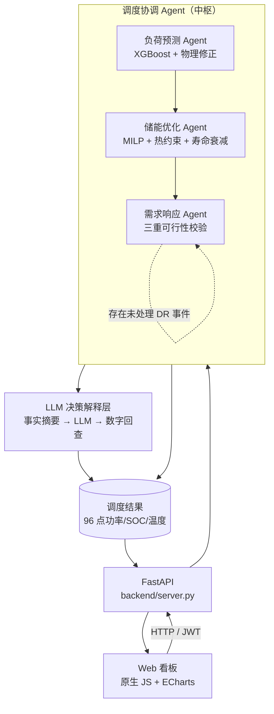

<div align="center">

# 汐储 TideShift

**工商业储能峰谷套利与需求响应多智能体优化系统**

把电池热损耗、温升约束与寿命衰减折算进 MILP 优化目标 —— 输出的不是好看的曲线，而是能落地的调度策略。


</div>

> ### ⚠️ 公网部署前必读
>
> 本项目面向**单机 / 内网**场景，默认只监听 `127.0.0.1:8800`。若要暴露到公网，**必须**先完成三件事：
> **①** 修改管理员口令（设 `ADMIN_INITIAL_PASSWORD` 或首登后立即改密）；**②** 置于 HTTPS 反向代理之后；
> **③** 限制 `config/` 与 `.solve_cache/` 目录的访问权限。细节见[配置项](#配置项)。

> ### 📊 数据来源声明
>
> 仓库内 `data/` 是**合成演示数据**（由 `src/data/data_generator.py` 按确定性日模式 + 3% 噪声生成），
> **不代表任何真实企业负荷**，不可用于生产结算或容量规划。系统支持上传自有数据自动切换，
> 见[使用说明](#使用说明) → 数据上传。所有量化结论均标注了复现环境与口径，见[量化成果](#量化成果)。

---

## 目录

- [项目简介](#项目简介)
- [界面预览](#界面预览)
- [核心功能](#核心功能)
- [系统架构](#系统架构)
- [环境依赖](#环境依赖)
- [安装](#安装)
- [快速开始](#快速开始)
- [使用说明](#使用说明)
- [配置项](#配置项)
- [项目结构](#项目结构)
- [核心技术细节](#核心技术细节)
- [量化成果](#量化成果)
- [测试](#测试)
- [常见问题](#常见问题)
- [贡献指南](#贡献指南)
- [已知局限与路线图](#已知局限与路线图)
- [许可证](#许可证)

## 项目简介

**汐储 TideShift** 是一套面向 1MW/2MWh 工商业磷酸铁锂储能系统的调度优化系统，按广东省工商业峰谷电价运行。它以 96 点（15 分钟粒度）为决策尺度，同时完成三件事：**预测次日负荷 → 求解最优充放电计划 → 评估并响应电网需求响应（DR）邀约**，最后给出可解释的决策说明。

与常见的储能调度 Demo 相比，本项目的差异点集中在**工程约束是否真的进入了优化模型**：

- 电池产热 `I²R(1+k)` 是功率的**二次项**，在许多项目里被简化成线性或直接忽略；本项目用 SOS2 分段**弦上逼近**在 MILP 内处理，且逼近方向保证保守安全；
- 寿命衰减不是常数，**深充深放（SOC 低区/高区）的衰减系数是浅充浅放的 2~3 倍**；本项目用 big-M + 二进制把每时段吞吐分配到 4 个 SOC 区段按系数加权计费，让优化器"看得见"真实成本结构；
- 加入**稳态日循环约束**（`SOC[96] == SOC[0]`），避免为了单日收益把初始 SOC 放空、次日无电可放这类不可持续的"账面最优"。

系统以 Web 看板形式交付（FastAPI + 原生 JS + ECharts，前端资源本地分发、完全离线可用），打开浏览器即可跑通全流程。

> **技术栈关键词**：PuLP / HiGHS、MILP + SOS2 分段线性化、XGBoost、LangGraph、LLM 决策解释层（含防幻觉回查）、FastAPI。

## 界面预览

点开「开始求解」后，系统会自动跑完「负荷预测 → MILP 调度 → 需求响应」全链路（本机实测 26 ~ 43 秒，含 MILP 求解）：


<details>
<summary>展开查看其余界面（充放电调度 / 电池热管理 / 深色主题 / 欢迎页）</summary>

<br/>

**充放电调度** —— 24h 充放电计划、峰谷套利、SOC 跟踪：


**电池热管理** —— 一阶 RC 热模型温度仿真、降额区间、寿命衰减：


**数据总览（深色主题）**：


**欢迎页** —— 提供「进入系统（演示数据）」与「上传我的数据」两条入口：


</details>

> 以上截图为真实界面（Playwright 驱动真实登录与求解流程生成），非设计稿。

## 核心功能

| 功能 | 说明 |
|------|------|
| 🌡️ **一阶 RC 热模型 + 二次产热线性化** | 基于传热学集总参数法建模电池温升；产热二次项用 SOS2 弦上逼近，温度上限约束保守安全 |
| 🔋 **SOC 区间寿命衰减** | 深充深放衰减系数 2~3 倍于浅充浅放，以 big-M 分段形式**写进优化目标函数**（非常数近似） |
| 🤖 **三 Agent 协同 + 双编排引擎** | 负荷预测 / 储能调度 / 需求响应三个 Agent，支持 LangGraph 有向图与纯 Python 线性两种编排，输出结果完全一致 |
| 📈 **物理修正负荷预测** | XGBoost + 温度-负荷传热学修正，并**内置朴素基线对照**（不回避基线更强的结果） |
| 📡 **需求响应三重校验** | 热安全 + 用能底线 + 收益校验三重把关，净收益为正才响应 |
| 🧠 **LLM 决策解释层** | 调度结果压缩为事实摘要后交由 LLM 组织语言；输出侧做数字回查，编造数字会被标注；无 Key / 断网 / 报错一律自动降级为规则模板 |
| 💬 **对话 Agent** | 规则模式 + LLM 模式双档，8 个工具函数（含整日解释、摘要内问答），支持 SSE 流式输出 |
| 📊 **Web 可视化看板** | 6 个页面（数据总览 / 充放电调度 / 负荷预测 / 电池热管理 / 需求响应 / 系统设置）+ 深浅双主题 |
| 📁 **自有数据接入** | 支持 NREL ComStock、中国工业负荷、标准格式三类文件自动识别；上传后调度缓存按数据指纹自动失效重算 |

## 系统架构



### 多智能体编排引擎（双模式）

**1. LangGraph 编排（推荐）** —— `src/agents/langgraph_coordinator.py`

有向图状态机，DR 事件处理为循环节点，通过条件边判断是否继续处理下一个事件：

```
init → load_forecast → storage_optimization → dr_handler ⇄ finalize → explanation → END
```

**2. 纯 Python 编排（轻量）** —— `src/agents/coordinator_agent.py`

线性流程 + `for` 循环处理 DR 事件，无 LangGraph 依赖。

两种模式的输出结果**完全一致**，由 `tests/test_langgraph.py` 自动验证，可放心按部署环境二选一。

## 环境依赖

| 项目 | 要求 |
|------|------|
| **操作系统** | Windows / Linux / macOS 均可（开发与实测环境为 Windows 10） |
| **Python** | **3.13**（唯一被完整验证过的版本，见 `.python-version`）<br/>3.11 及以下未验证，如需支持请先跑通 CI |
| **求解器** | HiGHS（经 `highspy` 提供，默认）／ CBC（PuLP 内置，自动回退） |
| **浏览器** | Chrome / Edge / Firefox 等现代浏览器（ECharts 已随仓库本地分发，无需联网） |
| **网络** | 完全离线可用；仅 LLM 解释层与对话 Agent 的 LLM 模式需要外网 |

Python 依赖分三份管理，职责不要混用：

| 文件 | 用途 | 安装命令 |
|------|------|----------|
| `requirements.txt` | 直接运行依赖，写成 `>=下界,<上界` 区间 | `pip install -r requirements.txt` |
| `requirements.lock` | **完整锁**：76 个包（直接 20 + 传递 56）全部钉到具体版本 | `pip install -r requirements.lock` |
| `requirements-dev.txt` | 开发/测试依赖（含 `pytest`、`coverage`、`httpx`） | `pip install -r requirements-dev.txt` |

**两个依赖文件的区别（重要）**

- `requirements.txt` 是**区间约束**：下界 = 实测通过版本，上界 = 下一个预期可能破坏兼容的版本。装出来的版本可能比实测新一个补丁号（例如 `langchain 1.3.14 → 1.3.15`），但**不会跨次版本跳变**。
- `requirements.lock` 是**完整锁**：直接依赖与全部传递依赖共 **76 个包**都钉到具体版本，装出来的依赖树与实测环境**逐版本一致**。**CI 与生产环境请用这一份。**
- 锁文件**不含 hash**：本项目跨平台（Windows / Linux / macOS），而 pip 的 hash 校验要求按平台分别记录每个 wheel 的 hash，会破坏跨平台可用性。需要 hash 级校验时，请在目标平台用 `pip-compile --generate-hashes` 或 `pip download` + `pip hash` 生成。

**版本约束约定**：收口粒度按风险分档——AI 编排栈（`langchain` / `langgraph` 系）收口到次版本，求解器 `highspy` 收口到次版本（版本会影响求解耗时与数值），科学计算 / 机器学习 / Web 栈收口到主版本。

> **为什么不写成 `~=`**：`langchain~=1.3` 等价于 `>=1.3,<2.0`，允许跨次版本升级。实测发现全新安装会解析到 `langchain 1.4.0`、`langchain-core 1.6.3`、`langchain-openai 1.6.2`、`uvicorn 0.53.0` 等**未经本项目验证**的版本，与 `requirements.lock` 记录的实测环境不在同一条次版本线上。收口后重新实测：直接依赖与实测环境**不再跨次版本跳变**（多数为补丁号差异，如 `langchain 1.3.14 → 1.3.15`、`langchain-core 1.5.3 → 1.5.6`）；唯一例外是 `uvicorn`（`0.52.1 → 0.53.0`，Web 栈按主版本收口）。需要逐版本完全一致请用 `requirements.lock`。

> 维护约定：改动 `requirements.txt` 的下界后，必须同步重新生成 `requirements.lock`（直接依赖区块须与实测版本逐条一致），并重跑 `pytest`（快测 + 全量）。

## 安装

```bash
# 1. 进入项目根目录（克隆或下载本仓库后）
cd energy-dispatch-proj

# 2. 创建虚拟环境（推荐，隔离依赖）
python -m venv .venv

# Windows
.venv\Scripts\activate
# Linux / macOS
source .venv/bin/activate

# 3. 安装运行依赖（二选一）
pip install -r requirements.txt     # 常规：允许补丁/次版本升级，仍在实测的主次版本线上
pip install -r requirements.lock    # 严谨：逐版本完全一致（含传递依赖），推荐 CI / 生产环境

# 4. 可选：安装开发与测试依赖（pytest / coverage / httpx）
pip install -r requirements-dev.txt

# 5. 可选：验证安装（需先完成第 4 步）
pytest -q
```

> **`pytest` 不在运行依赖里**——它属于 `requirements-dev.txt`。只想跑起服务的话，完成第 3 步后
> 直接跳到[快速开始](#快速开始)即可，无需安装第 4、5 步。

仓库已内置演示数据集（`data/` 下四个 CSV），**安装完即可直接启动，无需额外准备数据**。如需重新生成模拟数据：

```bash
python -m src.data.data_generator
```

## 快速开始

```bash
# 启动 Web 服务（默认 http://127.0.0.1:8800）
python backend/server.py
```

也可以使用一键脚本（自动打开浏览器）：

| 平台 | 命令 |
|------|------|
| Windows | 双击 `start_web.bat`；重启后端用 `restart_backend.bat`（会先释放 8800 端口再启动 + 健康检查） |
| Linux / macOS | `./start_web.sh` |

两个脚本都会**优先使用项目内 `.venv`**，不存在时回退到 `PATH` 中的 `python`，不硬编码任何本机路径。

### 登录与管理员口令

系统所有 `/api/*` 接口（除登录与版本信息外）受 JWT 保护，需先登录。管理员口令有两种管理方式，**按部署场景选一种**：

| 模式 | 设 `ENERGY_AUTH_MODE` | 口令来源 | 适合场景 |
|------|----------------------|---------|---------|
| **persistent**（默认） | 留空 | 首启：`ADMIN_INITIAL_PASSWORD` → 无则生成随机口令；此后以 `config/auth.json` 为准 | 本机长期使用、单机部署 |
| **env** | `env` | **始终**取 `ADMIN_INITIAL_PASSWORD`，不落盘 | 容器 / CI / 演示环境（改环境变量即生效，重装不用清文件） |

**persistent 模式（默认）**：

1. 启动前设 `ADMIN_INITIAL_PASSWORD` → 用它初始化，首登无需改密；
2. 不设 → 首启生成随机强口令，**同时**打印到控制台并写入 `config/INITIAL_PASSWORD.txt`（0600 的一次性副本）。首登会强制改密，改密成功后该文件自动删除。

**忘记口令**（不必手工找文件删除）：

```bash
python -m backend.manage show-state         # 只读：看认证模式、口令文件位置与状态
python -m backend.manage reset-password     # 重置为新的随机强口令并打印
python -m backend.manage reset-password --password '你的新口令'
```

> `ENERGY_AUTH_MODE=env` 时口令由环境变量托管，`reset-password` 会明确拒绝并提示改法
> （应用内改密同样返回 400 并说明原因），不会出现"改了却不生效"的静默行为。

**安全设计**：口令以 PBKDF2-HMAC-SHA256（200k 迭代）加盐哈希落盘；JWT 为 HS256、默认 12 小时过期，并绑定 User-Agent 指纹（**换浏览器或用 curl 复用浏览器 token 会 401 并提示"登录环境已变化"**——这是刻意设计，不是故障）；登录接口按 IP+账号限流，连续失败指数退避。未登录访问受保护端点返回 401。

登录后进入看板，点击**「开始求解」**触发完整调度流程（含 MILP 求解，本机实测 **26 ~ 43 秒**，随当日规模与机器性能变化；结果会落盘缓存，再次访问秒开）。

> 未求解时直接访问数据接口会返回 `409 Conflict`，这是预期行为，先点一次「开始求解」即可。

## 使用说明

### Web 页面

| 页面 | 内容 |
|------|------|
| 📊 **数据总览** | 收益 KPI、收益构成、告警条、AI 决策解释 |
| ⚡ **充放电调度** | 24h 充放电计划、峰谷套利曲线、SOC 跟踪、96 点明细 |
| 📈 **负荷预测** | 预测曲线与实际对比、多日准确率、朴素基线对照 |
| 🌡️ **电池热管理** | 温度仿真曲线、降额区间标注、寿命衰减折算 |
| 📡 **需求响应** | DR 事件触发与结果、三重校验过程、净收益核算 |
| ⚙️ **系统设置** | 模型供应商配置、电池/电价参数、主题切换、口令修改 |

侧栏还提供**对话 Agent**（规则 / LLM 双模式）与**数据上传 / 管理**入口。

### 数据上传

支持三种格式自动识别：

| 格式 | 必需列 | 说明 |
|------|--------|------|
| **NREL ComStock** | 含建筑类型与电耗明细 | 公开数据集格式 |
| **中国工业负荷** | `timestamp` + `consumption` | 常见企业侧导出格式 |
| **标准格式** | `timestamp` + `load_kw` | `price` / `temp` 可选 |

标准格式中 `price` / `temp` 可省略：省略时按广东工商业分时电价与季节温度模型自动补全，弹窗会**显式标注哪一列是补全的**。

> ⚠️ 负荷预测需要 **≥ 11 天历史数据**。这个门槛由三项开销叠加决定：滞后特征 `lag_672` 占 7 天、测试集固定切走 3 天、训练样本下限 1 天（`required_history_days()` 为唯一口径来源，此前文档写的"8 天"是错的——8 天只够抵消滞后开销）。历史不足时系统自动降级为朴素基线预测并**不做物理修正**，同时在总览页显示降级告警——这是刻意设计，避免用不足的数据硬训模型产出一组看似正常实则失真的数字。

### 配置 LLM（可选）

LLM 仅用于**决策解释**与**对话 Agent**，不参与任何计算。不配置也能完整跑通全流程（解释层自动降级为规则模板）。

```bash
# 任选其一即可，默认走 DeepSeek
export DEEPSEEK_API_KEY=sk-xxx
export OPENAI_API_KEY=sk-xxx
export LLM_API_KEY=sk-xxx

# 可选：自定义 OpenAI 兼容端点
export LLM_BASE_URL=https://api.deepseek.com/v1
```

也可以在 Web 界面「系统设置 → 模型供应商」中配置，Key 会经 Fernet 加密后落盘（`config/`，已被 `.gitignore` 排除）。

### API 一览

服务启动后可访问 `http://127.0.0.1:8800/docs` 查看 FastAPI 自动生成的交互式文档。主要端点：

| 方法 | 路径 | 说明 |
|------|------|------|
| `POST` | `/api/auth/login` | 登录，返回 JWT（有效期 12h，绑定 UA 指纹） |
| `POST` | `/api/auth/change-password` | 修改口令 |
| `GET` | `/api/system-info` | 版本 / Python / langgraph 版本（免认证） |
| `GET` | `/api/bootstrap` | 页面初始化数据 |
| `POST` | `/api/solve` | 触发完整调度求解 |
| `GET` | `/api/progress` | 求解进度 |
| `GET` | `/api/page/{dashboard\|scheduling\|thermal\|dr\|forecast}` | 各页面数据 |
| `POST` / `DELETE` | `/api/upload` | 上传 / 清除自有数据 |
| `GET` | `/api/export/schedule` · `/api/export/plan` | 导出调度明细 / 调度计划 |
| `POST` | `/api/dr/trigger` | 手工触发 DR 事件 |
| `POST` | `/api/params` · `/api/settings/save` · `/api/settings/reset` | 参数与设置读写 |
| `GET` / `POST` | `/api/providers` · `/api/providers/save` · `/api/providers/test` | LLM 供应商配置与连通性测试 |
| `POST` | `/api/explain` | 单独生成决策解释，返回 `{text, source}`；`source` 为 `llm` / `rule` / `none` |
| `POST` | `/api/chat` · `/api/chat/stream` · `/api/chat/clear` | 对话 Agent（含 SSE 流式），返回 `{reply, history, mode}`；`mode` 为 `rule` / `llm` |
| `GET` | `/api/chat/history` | 对话历史 |

## 配置项

复制 `.env.example` 为 `.env` 后按需填写（`.env` 已被 `.gitignore` 排除）：

| 变量 | 默认值 | 说明 |
|------|--------|------|
| `DEEPSEEK_API_KEY` / `OPENAI_API_KEY` / `LLM_API_KEY` | 空 | LLM 凭据，任选其一；留空则解释层降级为规则模板 |
| `LLM_BASE_URL` | DeepSeek 官方端点 | OpenAI 兼容 API 地址 |
| `ENERGY_HOST` | `127.0.0.1` | 服务监听地址；公网部署改 `0.0.0.0` 并置于反向代理之后 |
| `ENERGY_PORT` | `8800` | 服务端口 |
| `ENERGY_LOG_LEVEL` | `info` | uvicorn 日志级别 |
| `ADMIN_INITIAL_PASSWORD` | 空 | 管理员口令。**persistent 模式**下仅用于首次创建；**env 模式**下每次启动都生效 |
| `ENERGY_AUTH_MODE` | `persistent` | 认证模式：`persistent`（口令哈希落盘）/ `env`（口令仅来自环境变量，不落盘）。非法值回退 `persistent` |
| `ENERGY_CACHE_SECRET_FILE` | `config/.cache_secret` | 缓存 HMAC 签名密钥路径 |
| `ENERGY_CONFIG_DIR` | `config/` | **认证与密钥落盘目录**（`auth.json` / `.auth_secret` / `.api_secret`）。测试与只读部署用它把可变状态移出代码目录；pytest 会自动指向临时目录 |
| `LLM_TEST_ALLOW_HOSTS` | 空 | SSRF 白名单逃生口，仅自建 LLM 网关时需要 |

**部署到公网前请务必阅读**：本项目面向单机/内网场景设计，公网部署至少需要（1）修改默认管理员口令、（2）配置 HTTPS 反向代理、（3）限制 `config/` 与 `.solve_cache/` 目录的访问权限。

## 项目结构

```
energy-dispatch-proj/
├── backend/
│   ├── server.py                   # FastAPI 后端 + Web 静态服务（含 JWT 认证中间件）
│   ├── auth.py                     # 安全模块：JWT / Fernet / PBKDF2 口令存储
│   └── manage.py                   # 运维命令：show-state / reset-password
├── web/                            # 原生 JS 前端（无构建步骤）
│   ├── index.html
│   ├── css/app.css
│   ├── js/  (api.js / app.js / charts.js / pages.js / markdown.js)
│   └── vendor/echarts.min.js       # ECharts 本地分发，离线可用
├── src/
│   ├── agents/
│   │   ├── load_forecast_agent.py        # XGBoost + 物理修正 + 朴素基线
│   │   ├── storage_optimization_agent.py # MILP + 二次产热线性化 + SOC 加权衰减
│   │   ├── demand_response_agent.py     # 三重可行性校验
│   │   ├── coordinator_agent.py         # 纯 Python 编排
│   │   ├── langgraph_coordinator.py     # LangGraph 编排
│   │   ├── chat_agent.py                # 对话 Agent（规则 + LLM 双模式）
│   │   └── llm_explainer.py             # 决策解释层：事实摘要 + 数字回查 + 降级
│   ├── models/
│   │   ├── battery_thermal_model.py     # 一阶 RC 集总参数法热模型
│   │   └── battery_degradation_model.py # SOC 区间加权寿命衰减
│   ├── services/model_config_service.py # 供应商配置加解密
│   ├── data/
│   │   ├── data_generator.py            # 演示数据生成
│   │   ├── data_loader.py
│   │   └── upload_adapter.py            # 三格式识别与列补全
│   └── utils/
│       ├── config.py                    # 全局配置 + 热参数自洽校验
│       ├── cache_security.py            # 求解缓存 HMAC 验签 + 受限反序列化 + LRU
│       ├── url_guard.py                 # SSRF 防护
│       └── logger.py                    # 统一日志（RotatingFileHandler）
├── data/                            # 内置合成演示数据（可直接运行，非真实计量数据）
│   ├── load/load_data.csv
│   ├── load/dr_signals.csv          # DR 事件**示例数据**（⚠️ Web 流程不读取，见常见问题）
│   ├── price/typical_price.csv
│   └── battery/battery_params.csv
├── tests/                           # pytest 真实断言，无占位用例
├── docs/
│   ├── experiments.md               # 完整实验记录 + 未复核项清单 + 复现命令
│   └── screenshots/                 # README 引用的真实界面截图
├── licenses/                        # 第三方许可原文归档
│   ├── Apache-2.0.txt               # ECharts 许可原文
│   ├── echarts-NOTICE.txt           # ECharts 上游 NOTICE（Apache-2.0 §4(d) 要求随附）
│   └── zrender-BSD-3-Clause.txt     # ECharts 内嵌 ZRender 的许可原文
├── .env.example
├── .github/workflows/ci.yml         # CI：PR 快测 / nightly 全量 + 覆盖率
├── LICENSE                          # 本项目 MIT 许可
├── THIRD_PARTY_NOTICES.md           # 第三方组件与许可声明
├── requirements.txt / requirements-dev.txt / requirements.lock
├── pytest.ini                       # 测试配置（markers: slow / unit）
└── start_web.bat / start_web.sh / restart_backend.bat
```

> 密钥与运行时状态目录（`config/`、`.solve_cache/`、`.env`、`logs/`）不随代码分发，见 `.gitignore`。

## 核心技术细节

### 电池热模型（一阶 RC 集总参数法 + 二次产热）

```
C · dT/dt = I²R(1+k) − (T − T_amb) / R_th
```

参数取值：

| 参数 | 数值 | 依据 |
|------|------|------|
| 内阻 R | 0.018 Ω | 由 `(1-η)U²/P_rated` 反推，额定点 I²R 损耗 = P(1-η) |
| 热容 C | 15000 kJ/K | 约 13~20 吨电芯 × ~1 kJ/(kg·K)，含机架箱体 |
| 热阻 R_th | 0.001 K/W | 2MWh 集装箱自然对流 + 风机约 1 kW/K |
| 时间常数 τ | 4.17 h | 集装箱热响应量级 |

**MILP 内产热线性化**：产热是 P² 二次项，用 SOS2 分段**弦上逼近**（凸函数弦恒在曲线上方 → 保守安全）。`tests/test_storage_agent.py::test_heat_generation_is_quadratic_not_linear` 自动验证弦恒不低于真实产热。

温度保护策略：

| 温度区间 | 运行策略 |
|----------|----------|
| T < 45 ℃ | 正常充放电 |
| 45 ℃ ≤ T < 55 ℃ | 线性降额运行 |
| T ≥ 55 ℃ | 停止充放电 |

### 寿命衰减模型

SOC 区间衰减系数（深充深放是浅充浅放的 2~3 倍）：

| SOC 区间 | 系数 | 工程含义 |
|----------|------|----------|
| 0.0–0.2 | 3.0 | 锂析出风险高 |
| 0.2–0.5 | 1.5 | 中低区 |
| 0.5–0.8 | 1.0 | 最佳区间 |
| 0.8–1.0 | 2.0 | SEI 膜增长快 |

在 MILP 目标函数中用 big-M + 二进制把每时段吞吐分配到 4 个区间段，按对应系数加权计费。这让优化器**看得见**真实成本结构——知道在高 SOC 多吞吐的代价是 0.5–0.8 区间的 2 倍，从而做出更好的权衡（实测：精确模型净收益 1245.30 元 vs 常数近似 1224.08 元）。

### 稳态日循环约束

`terminal_soc="cyclic"`（默认）= `SOC[96] == SOC[0]`，确保日复一日可持续。

年化口径有三个，含义不同，对外引用时务必说明用的是哪一个：

| 口径 | 计算式 | 结果 | 含义 |
|------|--------|------|------|
| **同口径（推荐对外使用）** | (套利 − 衰减) × 365 | **43.7 万元/年** | 与基准策略同口径，不含 DR 补贴 |
| 含 DR（本系统 `/api` 的 `annual.net`） | (套利 − 衰减) × 365 + DR补贴 × 50 | **46.4 万元/年** | DR 按"每周约 1 次有效事件 ≈ 50 天/年"计入 |
| DR 每天都有（**不成立**） | 单日净收益(含 DR) × 365 | 63.2 万元/年 | 假设每天都有 DR 事件，与广东实际补贴频次不符 |

> DR 事件全年的实际出现频次取决于当地电网邀约，系统内按 50 天/年建模，这是**显式假设而非实测值**。

### 负荷预测物理修正

`physical_correction` 在 data-driven 模式（默认）下从验证集残差学习温度-残差斜率；当 XGBoost 已含温度特征时斜率 ≈ 0，修正自动近零。ablation 开关 `exclude_temp_features=True` 可让物理修正真正起作用。

### LLM 决策解释层

**要解决的问题**：纯编排式的"Agent"全程没有 LLM 参与，本质是工作流而非智能体。

**做法**：在 LangGraph 末端加 `explanation` 节点，把调度结果压成一份**事实摘要**（`DecisionDigest`），再交给 LLM 组织成人类可读的决策解释。三条硬约束：

1. **LLM 不碰计算**：优化结果来自 MILP，温度/衰减来自后验物理仿真，LLM 只消费已算完的数字，提示词里明令禁止自行推算。
2. **事实摘要是唯一事实来源**：96 点功率曲线先合并成"充/放电窗口"（如 `00:00–03:30 充电 平均 240kW，电量 840kWh，均价 0.32 元/kWh`），既省 token 又降低 LLM 乱读数的概率。
3. **输出侧防幻觉回查**：`check_grounding()` 把回答里带单位的数字逐条回查摘要，对不上号的标注在回答末尾。只查带单位的数字，"3 条原因"这类计数词不参与，避免无意义误报。

**降级链**：无 API Key / 网络失败 / 响应异常 / 任何报错 → 一律走 `template_explain()` 规则模板，输出结构与 LLM 一致，绝不把主流程拖挂。

实测（2026-09-08，2024-07-30 调度日）：

| 场景 | 结果 |
|------|------|
| 无 Key 跑全流程 | 解释来源 `rule`，规则模板正常输出 |
| mock LLM 编造 `9999.00 元` | 回查 2/3 命中，编造数字被标注在回答末尾 |
| mock LLM 抛异常 | 降级 `rule`，主流程不受影响 |
| 事实摘要数字条目 | 86 个（含充放电窗口的电量与均价） |

## 量化成果

以 1MW/2MWh 工商业磷酸铁锂储能系统、广东工商业峰谷电价、调度日 2024-07-30 为例：

| 指标 | 基准策略（谷充尖放） | MILP 优化（稳态） | 无热约束上界 |
|------|-------------------|------------------|-------------|
| 日套利收益 | 756.53 元 | 1702.79 元 | 1834.58 元 |
| 日衰减成本 | 130.04 元 | 504.67 元 | 525.58 元 |
| 日净收益（套利 − 衰减） | 626.49 元 | **1198.12 元** | 1309.00 元 |
| 最高电池温度 | 42.3 ℃ | 46.99 ℃（降额区） | 57.12 ℃（越过 55 ℃ 停机阈值） |
| 求解时间 | < 0.1 s | 38 ~ 43 s（HiGHS, MIP gap = 0%） | 24.1 s |

> 复现环境：Python 3.13.14 + `requirements.lock`。本表「日净收益」统一为**套利 − 衰减**（不含 DR 补贴），与基准同口径。
>
> ⚠️ **调度日口径**：本表为 **2024-07-30**。系统默认调度日取自可用日期列表的**中间日**
> （`dates[(len(dates)-1)//2]`；内置 30 天数据集为 2024-07-01 ~ 07-30，故默认为 **2024-07-15**），
> 因此首次打开看板看到的数字与本表不同（例如界面截图显示日净收益 1623.85 元、最高温 48.3 ℃）。
> 两者都是真实求解结果，只是日期不同，**不可横向比较**。2024-07-15 的完整实测数据见
> [`docs/experiments.md`](docs/experiments.md)。

**关键发现**

1. **优化 vs 基准 +91.2%**：差异主要来自 MILP 发现"峰价充电 + 尖峰放电"的二次套利机会（基准 0.488 次等效循环 → 优化 1.8925 次）。
2. **热约束的代价 −8.5%**（110.88 元/天）：换来温度从 57.12 ℃（已越过 55 ℃ 停机阈值）降到 46.99 ℃（进入 45–55 ℃ 线性降额区，距 55 ℃ 仍有 8.0 ℃ 余量）。
3. **稳态口径 vs 单日口径**：单日口径含 DR 补贴可达 1731.89 元/天，但代价是把初始 SOC 0.5 放空到 0.2（吃掉 600 kWh 存量），不可持续；稳态口径（套利 − 衰减）**1198.12 元/天 × 365 ≈ 43.7 万元/年** 才是能拿到的数。

### 年化口径（三个，含义不同）

| 口径 | 结果 | 含义 |
|------|------|------|
| **同口径（推荐对外使用）** | **43.7 万元/年** | 与基准策略同口径，不含 DR 补贴 |
| 含 DR | 46.4 万元/年 | DR 按"每周约 1 次有效事件 ≈ 50 天/年"计入 |
| DR 每天都有（**不成立**） | 63.2 万元/年 | 与广东实际补贴频次不符 |

### 负荷预测

30 天实测（2024-07-30 调度日）：项目 XGBoost **3.12%** MAPE，朴素基线 **3.01%** ——
**XGBoost 略输朴素基线 0.11 个百分点**。原因是合成数据为确定性日模式 + 3% 噪声，规律性极强，
朴素基线天然占优。改进方向见[已知局限与路线图](#已知局限与路线图)。

> 📄 **完整实验记录见 [`docs/experiments.md`](docs/experiments.md)**：三种策略逐项对比、
> 负荷预测 ablation 明细、LLM 解释层评测、复现命令，以及**未复核项清单**。
> 任何来自早期记录、本轮未重新验证的数字都在该文件里单独标注，引用时请先查该清单。

## 测试

```bash
# 快测（默认，跳过 slow 标记的分钟级用例）
pytest

# 全量（含真实 MILP 求解与端到端流程）
pytest -o addopts= -q

# 覆盖率
coverage run -m pytest -o addopts= && coverage report
```

> ⚠️ **PowerShell 用户注意**：在 PowerShell 下 `pytest -m ""` 不生效（空字符串参数会被 shell 丢掉，
> pytest 报 `argument -m: expected one argument`）。请用上面的 `-o addopts=` 清空 `pytest.ini` 默认的
> `-m "not slow"`，或使用等价表达式 `pytest -m "slow or not slow" -q`。Bash / zsh 下 `pytest -m ""` 正常。

测试规模 **102 项**（快测 79 项 + `slow` 23 项），全部为真实断言（无占位用例）。`slow` 标记的用例会真实执行 MILP 求解与全流程，分钟级耗时，故 PR CI 默认跳过、nightly 全量跑。

> 若 `tests/test_server_api.py` 在某个受限环境里首个用例就失败并报
> `PermissionError: [WinError 10013]`：那是 `TestClient` 依赖 loopback `socketpair()` 被沙箱拦截，
> 属环境约束而非项目缺陷。判据是单独运行该文件应当通过（`pytest tests/test_server_api.py -q`）；
> CI 运行在 `ubuntu-latest`，不受此限。

CI 状态徽章未放入本 README：动态徽章需要真实的仓库路径（`OWNER/REPO`），而仓库尚未建立。
`.github/workflows/ci.yml` 已就位，首次推送后按 GitHub 提示复制徽章 Markdown 即可启用。

| 测试文件 | 覆盖内容 |
|----------|----------|
| `test_storage_agent.py` | 能量守恒 / 热约束 / 衰减建模（slow） |
| `test_end_to_end.py` | 端到端流程（slow） |
| `test_langgraph.py` | 双编排引擎输出一致性（slow） |
| `test_load_forecast_ml.py` | 生产默认 ML 路径 + 数据泄漏防护 |
| `test_llm_explainer.py` | 解释层：摘要 / 数字回查 / 降级 / mock |
| `test_chat_agent.py` | 对话 Agent 工具函数 |
| `test_auth_security.py` | JWT / 口令 / 中文用户名边界 |
| `test_cache_security.py` | 缓存验签 / 白名单 / LRU |
| `test_server_api.py` | API 认证 / 首登强改密 / 限流 / SSRF |
| `test_models_boundaries.py` | 数值边界（除零 / NaN / 热模型末点） |
| `test_alerts_propagation.py` | 告警字段端到端透传 |

CI（`.github/workflows/ci.yml`）：PR 与 main 推送触发快测，每日 UTC 18:00（北京 02:00）跑全量 + 覆盖率。CI 使用 Python 3.13，与 `.python-version`、`requirements.lock` 三者口径统一。

## 常见问题

| 现象 | 原因与处理 |
|------|-----------|
| **忘记管理员口令** | 删除 `config/auth.json` 后重启，会重新生成随机口令并打印到控制台（或改用 `ADMIN_INITIAL_PASSWORD` 环境变量） |
| **登录后仍报 401** | JWT 有效期 12h 且绑定 UA 指纹；换浏览器或清缓存后需重新登录 |
| **首页打不开调度数据，返回 409** | 尚未求解。点击「开始求解」触发一次完整流程即可 |
| **端口 8800 被占用** | 改 `ENERGY_PORT` 环境变量，或使用 `restart_backend.bat`（会先释放端口） |
| **求解明显变慢（分钟级）** | 多半是 `highspy` 未装上，`pulp.HiGHS` 抛异常后静默回退到 CBC（约慢 4~5 倍）。检查 `pip show highspy` |
| **解释层一直是"规则模板"** | 未配置 LLM Key，或 Key 无效/网络不通——这是设计好的降级行为，不影响主流程 |
| **上传数据后预测精度很差** | 历史数据不足 11 天会降级为朴素基线且不做物理修正，总览页会有降级告警。门槛由 `required_history_days()` 推算：滞后特征 7 天 + 测试集 3 天 + 训练下限 1 天 |
| **DR 事件是从 `data/load/dr_signals.csv` 读的吗？** | **不是**。Web 流程按当前所选调度日**自动生成**两组默认 DR 事件（15:00–17:00 / 19:30–20:30），另支持页面手工触发与 `POST /api/dr/trigger`。`dr_signals.csv` 只是离线示例数据，其加载函数 `load_dr_signals()` 目前仅被测试引用，不在 Web 链路上——不要误以为改这个 CSV 能改变界面上的 DR 事件 |
| **默认调度日是哪一天？** | 取可用日期列表的**中间日**（`dates[(len(dates)-1)//2]`）。内置 30 天数据集为 2024-07-01 ~ 07-30，故默认 **2024-07-15**；上传自有数据后默认日随之变化。该规则刻意不硬编码日期，避免内置数据换区间后默认日落在数据之外导致页面空白 |
| **跑完 `pytest` 后启动服务，`ADMIN_INITIAL_PASSWORD` 不生效 / 任何口令都登录失败** | 早期版本会出现：测试把凭据写进了仓库 `config/`，服务读到测试生成的随机口令而跳过初始化。**现已修复**（测试状态隔离到临时目录，可用 `ENERGY_CONFIG_DIR` 覆盖）。若仍遇到：`python -m backend.manage show-state` 看现状，`python -m backend.manage reset-password` 直接重置——不必手工找文件删除 |
| **想让 `ADMIN_INITIAL_PASSWORD` 每次启动都生效（容器里常见）** | 设 `ENERGY_AUTH_MODE=env`。默认的 `persistent` 模式只在首次创建时读取该变量，之后以 `config/auth.json` 为准——这是刻意的，否则你在界面上改过的口令会在下次重启时被环境变量覆盖回去 |

## 贡献指南

欢迎提交 Issue 与 Pull Request。

### 开发环境

```bash
python -m venv .venv
# Windows: .venv\Scripts\activate    Linux/macOS: source .venv/bin/activate
pip install -r requirements-dev.txt
pytest            # 提交前必须通过
```

### 提交流程

1. Fork 仓库，从 `main` 切出特性分支：`git checkout -b feat/your-feature`；
2. 完成改动并补充/更新测试；
3. 本地跑通 `pytest`（涉及求解链路时再跑 `pytest -m ""`）；
4. 提交并推送，向 `main` 发起 Pull Request，在描述中说明**动机 / 改动内容 / 验证方式**。

### 提交信息规范

采用 [Conventional Commits](https://www.conventionalcommits.org/zh-hans/)：

```
<type>(<scope>): <简短描述>

feat(agents): 储能 Agent 支持自定义 SOC 区间衰减系数
fix(server): dashboard 端点补 alerts 字段透传
docs(readme): 更新量化成果表口径说明
test(thermal): 补充热模型末点边界断言
```

常用 `type`：`feat` / `fix` / `docs` / `test` / `refactor` / `perf` / `chore`。

### 代码约定

- **版本号唯一来源是 `src/__init__.py` 的 `__version__`**；改版本号后需同步更新 `CHANGELOG.md`。改动记录遵循 [Keep a Changelog](https://keepachangelog.com/zh-CN/1.1.0/) 与语义化版本。
- **物理量必须标注单位与口径**，涉及收益/损耗的计算需在注释中写明公式与量纲。
- **不得引入未声明的依赖**：新增依赖必须同步更新 `requirements.txt`，并视情况更新 `requirements-dev.txt` 与 `requirements.lock`；三份文件口径需保持一致。
- **严禁提交凭据与运行时状态**：`config/`、`.solve_cache/`、`.env`、`logs/` 一律不入库；如发现泄漏请立即改为读取环境变量。
- **测试用真实断言**：不接受只调用不断言的占位用例；涉及数值的断言应给出容差与依据。
- **修改优化模型时必须说明对目标函数的影响**，并补充或更新对应测试。

### 报告问题

提交 Issue 时请附上：Python 版本、操作系统、`pip freeze` 关键依赖版本（或确认使用 `requirements.lock`）、可复现的最小步骤与完整报错信息。

## 已知局限与路线图

**模型与算法**

- **需求响应按"放电量 × 补贴"结算，未建模 CBL 基线**：真实结算依据是相对基线负荷的削减量，当前口径会重复计利；
- **未建模需量电费（容量电价）**：这是工商业储能收益的重要组成，缺失会使收益被低估；
- **负荷预测 XGBoost 打不过朴素基线**：合成数据规律性过强所致。改进方向：改用直接多步预测（不递归喂回预测值）、至少在公开数据集（如 NREL ComStock）上做一次外部验证、把物理修正改为 ablation 开关而非默认开启；
- **极端工况校核不足**：可补充空调失效（更大 `R_th`）、夏季极端高温日（环境 35~40 ℃）等场景。

**AI 能力**

- **解释层只做单日事后解释**：未接 MPC 滚动重解释，也未让 LLM 参与参数寻优（当前刻意不让 LLM 碰计算）；
- **解释层缺少真实模型回归**：已用 mock 覆盖全路径（含幻觉回查、异常降级），接入真实 Key 后应补一次回归验证。

**工程**

- **单机/内网定位**：公网部署需自行补齐反向代理、HTTPS、口令与目录权限加固；
- **未做多用户与权限分级**：当前为单管理员账号模型。

## 许可证

本项目采用 **MIT License**，详见 [`LICENSE`](LICENSE)。

```
Copyright (c) 2026 qingfeng092802 (qingfeng092802)
```

你可以自由使用、修改、分发本项目（包括商业用途），但需保留原始版权声明与许可证文本。软件按"现状"提供，不附带任何形式的担保。

### 第三方组件

本项目**随仓库分发**了 Apache ECharts（`web/vendor/echarts.min.js`，Apache-2.0），其内部还包含
ZRender（BSD 3-Clause）与 Microsoft 的 0BSD 授权片段。版权与许可声明见
[`THIRD_PARTY_NOTICES.md`](THIRD_PARTY_NOTICES.md)，许可原文归档在 [`licenses/`](licenses/)。

Python 依赖不随仓库分发，由 pip 从 PyPI 安装，许可证随各自发行包提供；生成完整清单的方式见
第三方组件声明文档。

---

<div align="center">

**如果这个项目对你有帮助，欢迎 Star ⭐**

</div>
